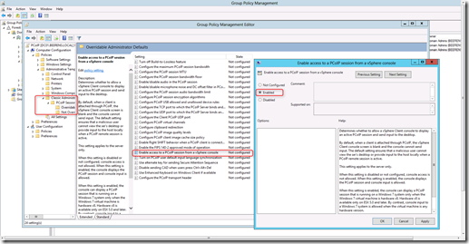
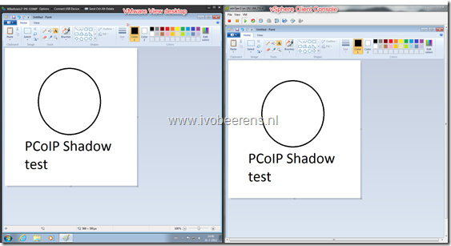

In VMware View there is no central way shadow a desktop session such as for example in Citrix XenApp. It would be nice if in the future it is possible to shadow a desktop from for example the VMware View Connection server. This is frequently asked question by customers were VMware View is implemented.

Brian Knudtson explain in his blog post  how to access a PCoIP session from the vSphere Console.

The following steps must be taken to shadow a PCoIP session from the vSphere Console by using a GPO:

- Use VMware vSphere 5 and VMware View 5 or greater (in vSphere 4 there is a registry hack available)
- For Windows 7 be sure to use Hardware Version 8. For Windows XP or Vista you can use any hardware version 
- Create a new Group Policy Object (GPO)
- Add the "**pcoip.adm**" file to the Computer Configuration. The  ADM file can be found on the VMware View Connection server in the "C:\\Program Files\\VMware\\VMware View\\Server\\extras\\GroupPolicyFiles" folder
- Enable the "Enable access to PCoIP session from a vSphere console" in the Computer Configuration settings.

- Link the GPO to the OU were the VMware View Windows 7 desktop resides
- Sync Domain Controllers
- Restart the VMware View desktop

After configuring this, it is possible to shadow a PCoIP session from the vSphere Console. T The user doesn't need to approve the shadow session so this could be security and privacy issue.  Here's are screenshot, The left side is the VMware View desktop and the right side is the vSphere client console:

The keyboard and mouse movements are displayed on the two screens synchronously. I don't know if it has any performance impact.