PHD Virtual Backup is a backup and recovery solution for VMware and Citrix environments. PHD Virtual Backup version 6 is released. We tested this new version with VMware vSpher

#### What's new in PHD Virtual Backup version 6:

PHD Virtual Backup version 6.0 contains the following major enhancements:

- **PHD Instant Recovery:** Instant Recovery lets you access your backed up data right away. The VM(s) will be powered on directly from the backup storage. Instant Recovery can be used for verifying backups or when needed mission critical data immediately. 
- **Application Aware Backups:** PHDVB v6.0 provides the ability to take application aware backups for any application.  Application aware backups include the ability to properly quiesce the application prior to backup, as well as perform any post-backup processes, such as automated log management (truncate, shrink, etc.).  This is done by leveraging a very small guest application called the **PHD Guest Tools**. 
- **Full and incremental backup mode:** Prior to v6.0, PHDVB provides a single backup mode called the virtual full.  Virtual Full backups include source-side deduplication across all backups within a backup target.  They are very efficient for storage utilization and backup and restore speeds. There are certain configurations that are not optimized to handle the many files that the virtual full leverages. Therefore, PHD is implementing a traditional full / incremental backup mode for those configurations such as using a CIFS share or deduplicating hardware appliance as the backup target or using 3rd party tools to copy full and incremental files off-site or to tape.
- **Email Enhancements:** The enhancements include: test Email, get HTML summary reports and fewer alerts
- **Encryption:** Those requiring strict requirements for backup data security can now choose to enable one of many types of industry standard encryption levels for PHD Virtual Backups.  When enabled, data will be encrypted at the file system level of the VBA to ensure that it is secure in transit to the backup target and at rest when it reaches the backup target.
- **Enhanced File Level Recovery (FLR):** In PHDVB v6.0, users will now be able to select an option to use CIFS for FLR, whereby the backup will be mounted to the VBA and presented out as a CIFS share. This allows the admin to share backup data so that other users can recover files or application items.  For additional flexibility, you can also choose or ability to present backups out as an iSCSI target from the VBA so that other machines can mount the backup as a local disk.  

#### Installation

PHD Virtual Backup has the following requirements:

- VMware vSphere 4.x or 5.x  needed as hypervisor for the Virtual Backup Appliance (VBA) and the plug-in
- 1 vCPU, 1024 MB memory and 8 GB free disk space on the datastore for the Virtual Backup Appliance (VBA)
- The PHD Virtual Backup Console can be installed on Windows XP, Windows Server 2003, Windows 7, Windows Server 2008, Windows  
    Server 2008 R2, or Windows Vista, with .NET Framework version 2.0 SP2 or later.

The installation of PHD Virtual Backup consist of two steps:

1\. Install the PHD Virtual Backup Console.

This is a small executable that installs the PHD Virtual Backup Console and vSphere Client plugin.  After the installation, the PHD Virtual Backup plugin is installed on the vSphere client and on the desktop is a PHD Virtual Backup console icon placed.

<table border="0" cellspacing="0" cellpadding="2" width="400"><tbody><tr><td valign="top" width="398"><a href="images/image21.png">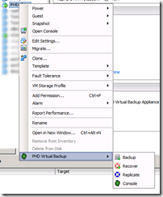</a></td></tr></tbody></table>

2\. Deploying the Virtual Backup Appliance (VBA) appliance

Via the vSphere client the Virtual Backup Appliance (VBA) appliance (OVF) can be deployed.  

[]

When the Virtual Backup Appliance (VBA) appliance is deployed, it can be powered on.

#### Configuration

First we need to give the Virtual Backup Appliance (VBA) an IP Address by opening the PHD Virtual Backup Console, select configuration and select the network tab.  

[]

After settings the IP configuration we configure the following tabs options in the configuration menu:

_General_

- time zone
- NTP servers
- vCenter credentials

[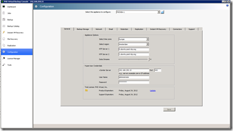]

_Backup Storage_

- Backup Storage type: None, Attached (Virtual Disk(s), NFS and CIFS. When using Attached (Virtual Disk(s) you can add one or more disks to the VBA and create a backup greater than 2 TB.
- Backup Storage Thresholds

[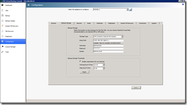]

_Email_

- configure email reporting recipient(s)  

[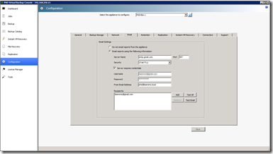]

The initial basic configuration is now done.

#### Backup

First we describe the general backup options available in PHD 6.  There are two backup modes available:

- **Virtual Full Backups**: After the initial backup is created, only changes are recorded. This saves time and network bandwidth.  These small files of changes are stored along with links to previous changes all the way back to the initial backup, presenting a  
    virtual "full" version of the backed up VM available for restore at any point in time. This ensures your backed up virtual machines  
    are always available with no additional requirements. Virtual Full Backups are ideal for backing up directly to disk (Attached disk to the PHD VBA).

 [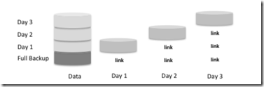](images/image28.png)

- **Full/Incremental Backups (new)**: Consist of a single full backup and many incremental files with the changes since the last full backup. This is called a backup chain. All backups in the chain must be available to successfully restore a VM. Full/Incremental backups are recommended when backing up to network storage, for backups sent to tape often, and for storage not optimized for backup. For example, when using certain CIFS storage types, you may consider using Full/Incremental backup mode. Full/Incremental backup do not support Instant VM Recovery or export via PHD Exporter!

_**PHD Guest Tools (new)**_

PHD Guest Tools enable application aware processing for individual virtual machines including quiesce, log truncation, and the  
ability to run custom scripts.

PHD Virtual Backup takes advantage of Microsoft's Volume Shadow Copy Service (VSS) to perform quiesce for any VSS-aware  
applications running on the virtual machine to ensure an application-consistent backup is created. In addition, log truncation  
options are available for Microsoft Exchange, to avoid running out of storage space on your VM.

Application aware processing and custom scripts can be configured in the backup job.

Scripts can be used to perform application aware processing in the guest VM.  In fact, I'm told that PHD will be supplying scripts for SQL Server log management in their GA release. Additionally, you can make your own application aware processing scripts for other databases and applications that run on Windows.

The installation of the PHD Guest Tools can be done by using the ISO or the executable file.

[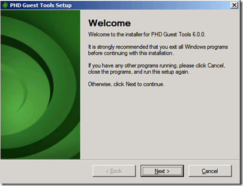](images/image31.png)

Application aware processing scripts can be place in the "scripts.d" directory on the guest VM were the PHD Guest Tools are installed.

**_PHD Virtual Backup Exporter_**

The PHD Virtual Backup Exporter lets you export backup files in any existing backup storage location for long term or offsite  
storage. When the PHD Exporter is configured, the compressed and deduplicated backup files stored on your PHD VBA's backup storage locations are exported to an external staging location in standard OVF format

PHD Virtual Backup Exporter is a separate Windows utility that needs to be installed.

**_Backup Data Connector_**

With the Backup Data Connector, you can allow access to all of your backup files through the PHD VBA via an SMB/CIFS share. Then you can use third-party tools or your own scripting to copy and move these uncompressed files to tape or to another disk location. This can be configured in the configuration menu under Connectors:

[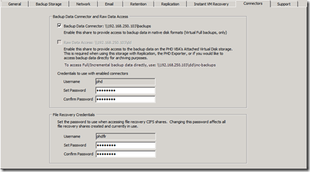](images/image36.png)

Below is the share location of the Backup Data Collector:

[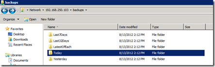](images/image37.png)

**_TrueRestore_**

TrueRestore is a verifying technology that ensures that the data backed up can be restored. Verify options can be enabled during the backup and restore.

**Creating a Backup Job**

First you need to create a backup job. Here are the steps for creating a backup job:

- In the vSphere client, right click on a VM and select "PHD Virtual Backup" and select **Backup**.

[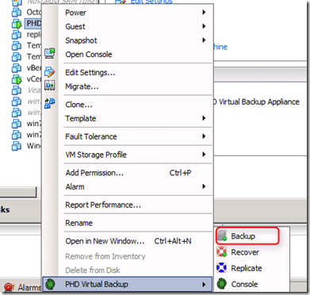](images/image33.png)

- Select the VMs you want to backup. It is possible to exclude disks

[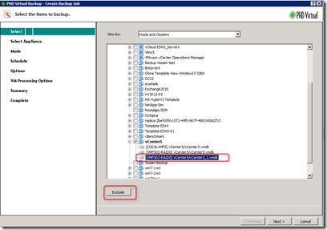](images/image34.png)

- Select the Backup appliance
- Select the backup mode Virtual Full or Full/Incremental

[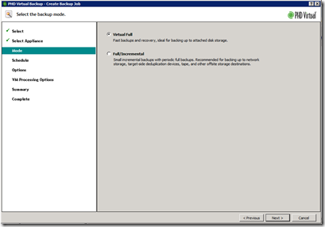](images/image49.png)

- Schedule: Now, Once, Daily and Weekly.

[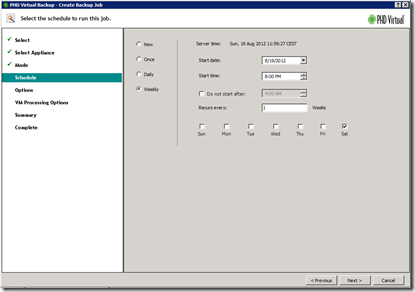](images/image50.png)

- Options: Job Name, Verify Backup (**TrueRestore**), powered off virtual machines, and use Changed Block Tracking (minimal Hardware Version 7 needed)!

[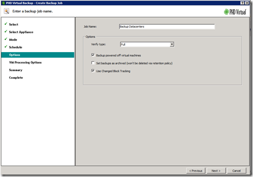](images/image51.png)

- VM Processing Options: Quiesce applications, truncate logs and run custom scripts (requires PHD Guest Tools)

[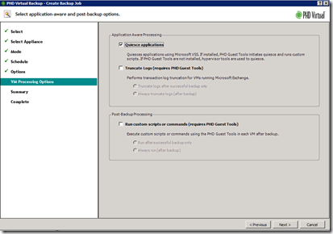](images/image52.png)

- Summary
- Complete

After the above steps the configuration of backup job is ready.

#### Recover

To recover or restore a VM or file you need to configure a recover job using the following settings:

- In the vSphere client, right click on a VM and select "PHD Virtual Backup" and select **Recover**.

[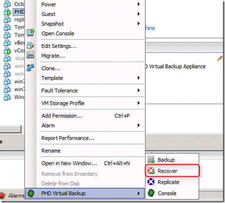](images/image38.png)

- Select the appliance to restore from

- Select the Virtual Machine(s) to restore

[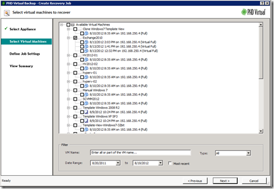](images/image53.png)

- Define Job Settings. Enter the job name, Select the recovery type, select the storage and network the VM will be restored to and configure the schedule

[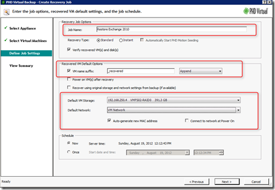](images/image54.png)

- View  Summary

**Recover single files and subfolders (new)**

It is possible to restore individual files (File Level Recovery) from the VM backups. PHD creates a Windows share (CIFS) or iSCSI target from the backups. You can easily browse and recover the files and subdirectories needed.

[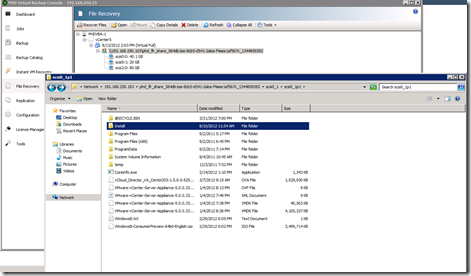](images/image40.png)

**Instant VM Recovery (new)**

Instant Recovery lets you access your backed up data right away. The VM(s) will be powered on directly from the backup storage. Instant Recovery can be used for verifying backups or when needed mission critical data immediately. 

Configure Instant VM Recovery:

- In the Configuration menu select the Instant VM Recovery tab
- Configure were changed data is stored (Instant VM Recovery Write Space) when the instant VM(s) are started

[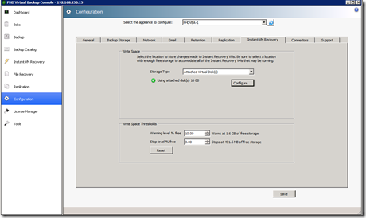](images/image41.png)

- Create a Instant recovery job.

[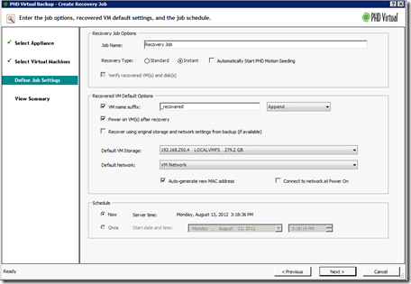](images/image42.png)

There are two ways to move the VMs from the Backup location to the production storage using a Storage vMotion (NO downtime) or using PHD Motion (small downtime window). Use PHD Motion if you don't have the proper license to perform a Storage vMotion.

[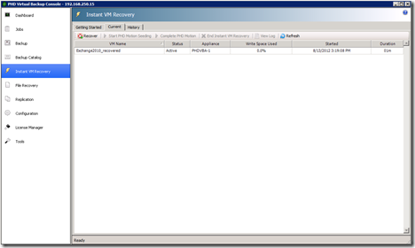](images/image43.png)

#### Replication

With PHD Virtual Backup, you have the ability to further protect your virtual environment by replicating virtual machines from one  
environment to another (DR site). PHD Virtual Backup VM Replication takes advantage of existing VM backups created by PHD VBAs.

VM replication can be used in the following scenarios:

- Using a single PHD VBA. VMs can be replicated within the same virtual environment from one host to another. This is done by creating backups for your VMs, then creating replication jobs that will create replicas of those VMs on another host in the same virtual environment.
- Replicating VMs from the primary site to a DR site.  In this scenario, the PHD VBA  
    at the DR site would be configured to connect to the primary site's backup storage directly, then use that data to create the  
    replica VMs on the hosts at the DR site. Then as backups are created at the primary site each night, replicas can be updated  
    with the changed data from each backup.

To configure VM replication with a primary and DR site use the following global steps:

- Deploy a new PHD VBA at your DR site
- Configure the PHB VBA to use the backup location of the primary site in the replication tab

[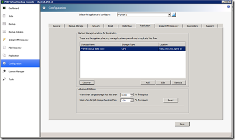](images/image44.png)

- Create VM replication job(s). Select the VMs to replicate, select the server, datastore and network.

[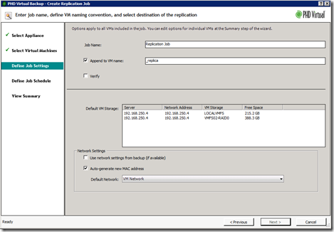](images/image47.png)

- Run the replication job(s).
- The Replicas can be managed in the replication menu. You can test and failover the VM(s).

[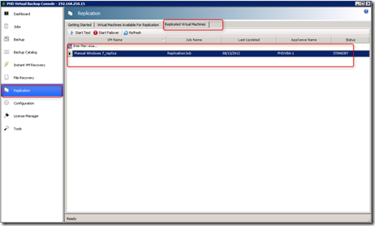](images/image48.png)

#### Reports (new)

The reports function is much improved. The HTML reports present information such as:

- Global information:  Status, Duration, Data Written, Speed (MB/s), total VMs and total disks
- Per VM info such as status, Started, Ended, Size, Speed, Data Written and messages

[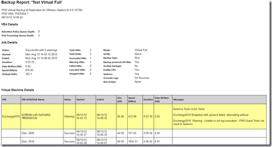](images/image45.png)

#### Licensing

PHD Virtual Backup is licensed per hosts. If you purchase a 2 host license you can backup all the VMs on the 2 hosts. The replication to other hosts requires an extra license per host.

#### Conclusion

PHD Virtual Backup 6 has great new features. It's easy to install and configure and it integrates in vCenter. Because it is a small appliance, it involves no operating system license cost.  You can scale up by adding more appliances when needed. The Instant VM Recovery can be very useful when you need the mission critical data immediately and he File Level Restore (FLR) is so easy to use!  When searching for backup and recovery solution, PHD Virtual Backup 6 is certainly worth to try!

**_General Availability for PHD Virtual version 6.0 will occur August 27, 2012!_**