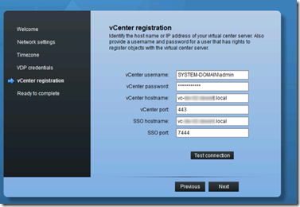

vSphere Data Protection (VDP) is replacing VMware Data Recovery (vDR). VDP is a more robust product based on the EMC Avamar product.

Here are some VDP implementing tips:

- Each vCenter server can support up to 10 VDP appiances
- Each VDP appliance supports up to 100 VMs
- VDP stores deduplicated data on the   0.5,1 or 2 TB datastores.
- It is not possible to use CIFS or NFS shares directly from the VDP appliance.
- VDP comes in 3 different OVA sizes 0,5TB, 1TB and 2TB.  Amount of disk space needed:

| **OVA Size (TB)** | **Disk Space Required (GB)** |
|---|---|
| 0,5 | 850 |
| 1 | 1600 (1,57 TB) |
| 2 | 3100 (3,02 TB) |

- It is not possible to expand the VDP destination datastore
- VDP is managed by the vSphere Web client
- At least one vCenter 5.1 server is required 
- VDP is included in vSphere 5.1 Essentials Plus and higher
- To configure the VDP appliance use the following URL: _**https://ip**_ _**appliance:8543/vdp-configure/**_
- The default username is _**root**_ and the password is **_changeme_**
- For the VDP vCenter registration use formats as in the screenshot:

- After the VDP is configured the following URL can be used to do some configuration and maintenance:  **_https://<ip_** **_address of VDP appliance>:8543/vdp-configure/_**

- VDP supports up to 8 simultaneously backups of 8 VMs