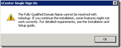

Before starting the upgrading to version 5.1 of the vCenter Server, the following steps can be taken to be able to successfully upgrade. The first step is reading the upgrade guides. After the RTFM stuff check the following:

- Make sure the SQL Server authentication checkbox is set to **SQL Server and Windows Authentication mode** on the SQL server. More info found [here](https://www.ivobeerens.nl/2012/09/11/vcenter-5-1-single-sign-on-error-during-installation/).
- The SQL server service is listening to port 1433. You can check this by using the following command:

> **_netstat –a | find “1433”_**

if the SQL Server is not listening on port 1433, use the following steps:

1. Open SQL Server Configuration Manage
2. Expand the SQL Server Network configuration
3. Click on the “Protocols for **SQLEXP\_VIM**”. **SQLEXP\_VIM** is the name of the SQL instance
4. Select TCP/IP – Properties – IP Addresses tab an scroll down to **IPALL,** enter value **1433** in the TCP Port field
5. Restart the SQL Server service

- Open the sql script called “rsaIMSLiteMSSQLSetupTablespaces.sql”  (found in the vCenter ISO in `…..\Single Sign On\DBScripts\SSOServer\schema\mssql\`) and customize the location of the \*.mdf, \*.ndf and \*.lfd file to your needs. After customizing the SQL file execute it and make sure the RSA database is created.

- If installing Single Sign On in a IPv6 environment check [this](http://kb.VMware.com/selfservice/microsites/search.do?language=en_US&cmd=displayKC&externalId=2035454) KB article
- If after upgrading the vCenter services hangs on startup check [this](http://kb.VMware.com/selfservice/microsites/search.do?language=en_US&cmd=displayKC&externalId=2035623) KB article
- The warning “**The Fully Qualified Domain Name cannot be resolved. If you continue the installation, some features might not work correctly**” appear during the installation. Make sure the reverse DNS record exist in the Reverse lookup Zones.  Test this with the nslookup command

- The vCenter Server services hang on starup after upgrading to vCenter Server 5.1. More info can be found [here](http://kb.VMware.com/selfservice/microsites/search.do?language=en_US&cmd=displayKC&externalId=2035623).