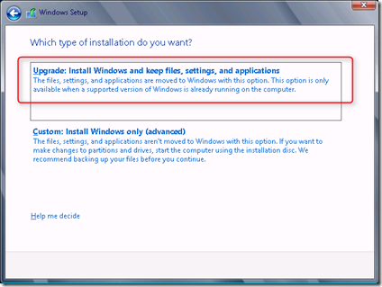

Now Windows Server 2012 is release I tried to upgrade my lab environment from Microsoft Windows Server 2012 RC 8400 to Windows 2012 RTM. It is not officially supported to upgrade from Windows Server 2012 RC to Windows Server 2012 RTM by Microsoft.

I did the following steps to upgrade:

- Downloaded  the Windows Server 2012 ISO
- Mount or extract the ISO
- Executed setup.exe
- After several screens it is possible to choose for "**Upgrade: Install Windows and keep files, settings and applications**" option

- Now the he following error appeared:

> The upgrade cannot continue. The upgrade you needs to be running the following Windows Server 2012 build number of higher: 8508.0

- use the work around by editing  the file "cversion.ini"  found in the "sources" folder. Change the "**MinServer=8508.0**"  line in "**MinServer=8400.0**"

- Start the setup process  again. Now repeat the above steps.  The installation checks the compatibility. In my case the following errors are displayed:

- To solve the above errors I did the following things:

> - Uninstall the Intel Wired PROset for Windows software
> 
> - Because the Active Directory (AD) role is installed, I needed to upgrade the AD schema by using the ADPREP /FORESTPREP and ADPREP / DOMAINPREP commands
> 
> - Reboot the system

- Again the setup process must be started and the upgrades completes. After the upgrade the Windows Server 2012 version is Build 9200 (RTM).

