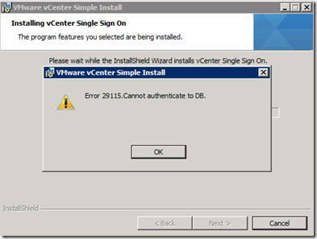
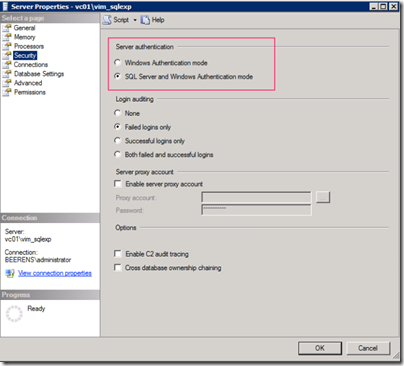

Today vSphere 5.1 is released. I did an upgrade of my existing vSphere 5 vCenter server. During the installation of the vCenter Single Sign On (SSO) software the following warning occurred:

Error 29115: Cannot authenticate to DB.

After this error the installation stops and the rollback begins. To solve this make sure the **server authentication** checkbox is set to **SQL Server and Windows Authentication mode** on the SQL server.

Thanks to [Gabrie van Zanten](http://www.gabesvirtualworld.com/) and [Maish Saidel-Keesing](http://technodrone.blogspot.com/) for helping me out!