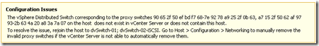
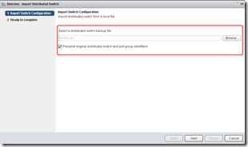

Migrating to a new fresh vCenter server using the vSphere Distributed Switch (VDS) prior vSphere 5.1 is not a easy task. The VDS is part of the vCenter configuration. If you try to import hosts that have a VDS configuration to a new vCenter server the following warning will appear:

> The distributed Virtual Switch corresponding to the proxy switches d5 6e 22 50 dd f2 94 7b-a6 1f b2 c2 e6 aa 0f bf on the host does not exist in vCenter or does not contain the host.

vSphere 5.1 supports to backup and restore the VDS configuration. This makes it possible to migrate the VDS configuration on a new vCenter  server very easily, without to migrate the VDS first to the vSS on the old vCenter server and on the new vCenter server migrate the vSS to the VDS. 

Here are the steps:

- Upgrade the old vCenter server to version 5.1
- Install a new vCenter 5.1 server and create a datacenter and cluster
- Export the DVS configuration on the old vCenter server
- Disable HA on the old cluster(s)
- Disconnect all the hosts on the old vCenter server
- Import all the hosts  on the new vCenter server. The following warning is displayed and it is safe to ignore the warning:

- Import the VDS configuration on the new vCenter server

- Remove the disconnected hosts on the old vCenter server

After the VDS import, the warning will disappear and the VDS configuration is migrated to the new vCenter server.