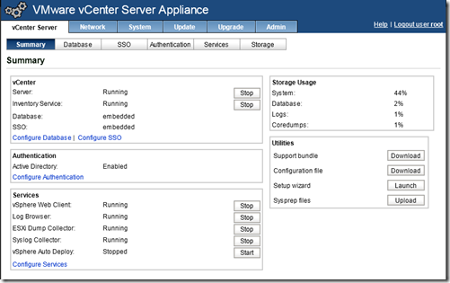

I get a lot of questions from customers if the could use the VMware vCenter Server Appliance (VCSA) in there production environments as replacement for the standard vCenter Server. With the standard vCenter Server is based on Microsoft Windows. you know for sure that all the other vSphere products are supported and integrate. But what about vCenter Server Appliance (VCSA) 5.1?

The vCenter Server Appliance (VCSA) 5.1 is a 64-bit SUSE Linux Enterprise Server 11 OVF appliance.  The appliance is installed default with 2 vCPUs, 8 GB memory and consumes between approximate 5 GB and 80 GB of disk space.  This is the configuration for a small inventory (up to 100 hosts and 1000 VMs). If the environment is larger you need to scale up the appliance hardware configuration.

After the deployment the initial configuration can be done by using the wizard.

On the VCSA appliance the following components are preinstalled:

- vCenter Single Sign On (SSO)
- Inventory Service
- vSphere Web Client
- vSphere Auto Deploy Server
- Syslog Collector
- ESXi Dump Collector

During the web based configuration the following  database options can be selected:

- The embedded database is a vPostgres database that has support for 5 hosts and 50 Virtual Machines. This is what the installation guide says about the vPostgres:

> IMPORTANT   The embedded database is not configured to manage an inventory that contains more than 5 hosts  
> and 50 virtual machines. If you use the embedded database with the vCenter Server Appliance, exceeding  
> these limits can cause numerous problems, including causing vCenter Server to stop responding

- As external database the VCSA support Oracle only! Using  the Oracle database has support for 1000 hosts and 10.000 Virtual Machines.

The installation and configuration is very easily. Within a couple minutes the VCSA is up and running.

**Pros:**

- Very easy and quick to install and configure
- No Windows license needed
- Easy to install an update and upgrade
- Quick recovery of the vCenter appliance  

**Cons:**

- The embedded vPostgres database has support for 5 hosts and 50 VM's.
- As external database only Oracle is supported.
- No Linked mode support (requires ADAM (AD LDS)
- No SQL Server as backend database support
- VMware Update Manager can't be installed in the VCSA, additional Windows based VM or physical server needed.
- vCenter Heartbeat is not supported
- VMware View is not supported
- Not all 3e party plugins will work

**Conclusion:**

The embedded database has limited support so it only usable in small SMB and test environments on the moment. For the external database only Oracle is supported. VMware Update Manager is not preinstalled, so you need an extra Windows Server for installing VMware Update Manager.  When these and above issues are fixed in further versions, it's a great and easy way to set up an vCenter Server environment without using Windows!