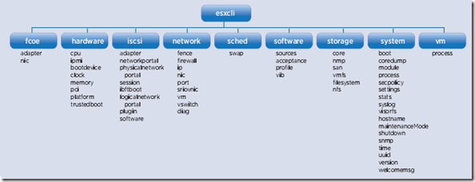

ESXCLI commands are very useful for configuring and troubleshooting ESXi servers. The vSphere vCLI 5.1 includes the following namespaces:

Here is a small list of some examples of ESXCLI commands:

### esxcli system

**Show ESXi version and build**

`esxcli system version get`

**Enter Maintenance Mode**

`esxcli system maintenanceMode set –-enable yes`

**Exit maintenance Mode**

`esxcli system maintenanceMode set --enable no`

**List only advanced settings that have been changed from the system defaults**

`esxcli system settings advanced list –d`

**List only kernel settings that have been changed from the system defaults**

`esxcli system settings kernel list –d`

**List / Change / Test SNMP**

`esxcli system snmp get | hash | set | test`

### esxcli vm

**List VMs on the ESXi server with the World ID**

`esxcli vm process list`

**Kill a VM**

`esxcli vm process kill –t soft -w WorldID`

### esxcli software

**Install updates and drivers on a ESXi host (make sure the ESXI host is MaintenanceMode)**

`esxcli software vib install -d /vmfs/volumes/VMFS01/patches/nameoftheupdate.zip`

### esxcli network

**List physical NICs and connection state**

`esxcli network nic list`

**List network information for the VM**

`esxcli network vm list`

### esxcli storage

**List the devices currently controlled by the VMware NMP Multipath Plugin and show the SATP and PSP information associated with that device**

`esxcli storage nmp device list`

**List VAAI properties for devices currently registered with the PSA.**

`esxcli storage core device vaai status get`

**Change the default pathing policy to Round Robin**

`esxcli storage nmp satp set --default-psp VMW_PSP_RR --satp youre_satp_policy`