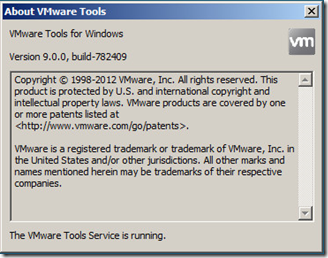
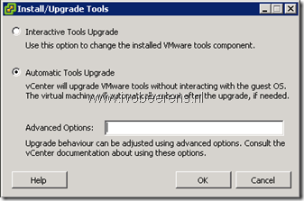
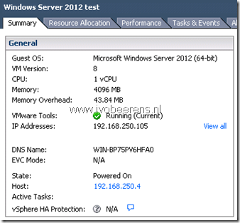
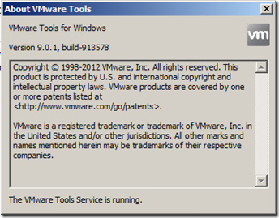

**Update February 22, 2013**: William Lam created a clarification on the Zero-Down Time) VMware Tools Upgrade. Here is a quote from the post:

> Is there downtime when upgrading to future versions of VMware Tools?
> 
> It depends. If one or more components have been updated since the last VMware Tools upgrade or one of the VMware Tools components requests a system reboot, then a reboot will be required. The following VMware KB [**http://kb.VMware.com/kb/2015163**](http://kb.VMware.com/kb/2015163) has been created to help identify the components that would require a reboot. A reboot would not be require if only the base components of VMware Tools have been upgraded (e.g. no PVSCSI, VMXNET3). You can refer to the above KB for components that require a reboot.

More information can be found [here](http://blogs.VMware.com/vSphere/2013/02/clarification-on-zero-down-time-VMware-tools-uprade-in-vSphere-5-1.html).

**Update December 24, 2012:**

One of the cool new features of **vSphere 5.1** is that you can update the VMware tools without the requirement  to reboot each Virtual Machine (VM). It is called zero-downtime upgrade for VMware Tools.

When upgrading from a early version of vSphere such as 4.x and 5 the VMware tools  update still needs a reboot when updating. Once you are on ESXi 5.1 and updating all the VMs to the latest VMware tools, no reboots will be required for **subsequent** VMware Tools upgrades!

**To make this work you need at least VMware tools 9.0.0 build-782409.**

In this example I upgraded first the vCenter server 5.1 to 5.1.0B and installed the latest patches on all the ESXi 5.1 hosts (build 914609) in the cluster. After the upgrade of all VMware ESXi  5.1 hosts, the VMware tools versions of all the VMs reports that the are **Out-of-date**. This is tested with versions 9.0 Build 782409 of the VMware tools.

In the vSphere client, click VM in the virtual machine menu, then click Guest > Install/Upgrade VMware Tools and click OK.

Choose Automatic Tools Upgrade for an unattended upgrade.

After some time the VMware tools are updated the latest version **without a reboot!** This example can be a good business case for upgrading  to vSphere 5.1!