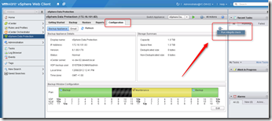

Here are the steps outlined for upgrading the vSphere Data Protection (VDP) appliance.

1\. Check the version of the VDP.  SSH to the VDP appliance and use the following command:

`rpm –qa | grep vdr`

The current version of the VDP appliance is: `vdr-1.1.53-53`

2\. The vSphere (web) client displays version 5.1.0.0 (5.1.0.0). This version will not change after the upgrade.

3\. Shutdown the VDP appliance.

4\. The virtual disks used by the vSphere Data Protection appliance are set to be “Independent - Persistent.” However, in order to take a snapshot, the disks will have to be temporarily changed to “Dependent.” Starting with Hard disk 2 till disk 7

.

5\. Take a snapshot.  This must be done else you wont be able to upgrade the VDP appliance

6\. Start the VDP appliance. Wait till the VDP appliance is started. It can takes 10 minutes!

7\. Download the VDP upgrade ISO needed and verify the checksum of the ISO!

8\. Mount the upgrade ISO to the VDP appliance using VM Edit Settings.

9\. Connect to the appliance using the following URL:

https://ip address of VDP appliance:8543/vdp-configure/

10\. Login the appliance (username is root)

11\. Go to the upgrade tab. Click check upgrades (be patient it will take some time to see the upgrade package)

12\. Select the package and press the upgrade VDP button

13\. The warning “No valid Integrity Check taken Today of Yesterday”  appeared.

Run a manual Integrity Check by using the  vSphere Web Client, select “Run Integrity Check” in the vSphere Data Protection plugin.

14\. Watch in the tasks till the VDP Integrity check completes

15\. Select the package and press the upgrade VDP button

16\. Wait till upgrade completes

17\. Shut down the VDP appliance

18 . Delete the snapshot

19\. re-enable the independent disks

20 . Detach the ISO VDP upgrade

21\. Start the VDP appliance

22.  Check the version of the VDP appliance. Make a SSH connection and use the following command:

rpm –qa | grep vdr

The new version of the VDP appliance is: vdr-1.1.56-56.  The vSphere (web) client displays still version 5.1.0.0 (5.1.0.0).

