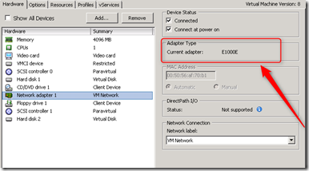

The following VMware releases are supported with Windows 8 and Windows Server 2012:

| **OS** | **Supported versions** |
|---|---|
| Windows 8 32/64 Bits | Workstation 9    Fusion 5.0    ESXi 5.0 U1    ESXi 5.1 |
| Windows Server 2012 64 Bits | Workstation 9    Fusion 5.0    ESXi 5.0 U1    ESXi 5.1 |

Windows 8 and Windows Server 2012 are supported on ESX 5.0 U1 and 5.1. Here are some things to watch when implementing Windows 8 or Windows Server 2012 on ESXi environment.

### vNIC

For Windows 8 and Windows Server 2012 the E1000e adapter is the default vNIC. The E1000e feature emulates a newer model of Intel Gigabit NIC (number 82574) in the virtual hardware. This is known as the "e1000e" vNIC. e1000e is available only on hardware version 8 (and newer) virtual machines in vSphere 5! 

`VMXNET 3`

The VMXNET 3 is optimized for performance in a virtual machine. Because operating system vendors do not provide built-in drivers for this card, you must install VMware Tools to have a driver for the VMXNET3 network adapter available. The VMXNET3 is available only on hardware version 7 and newer!

### SCSI Disk controller

The default SCSI disk controller is the LSI Logic SAS.

`PVSCSI`

The Paravirtual SCSI (PVSCSI) adapters are high-performance storage adapters that can result in greater throughput and lower CPU utilization.  When browsing through the FLP images there is no Windows Server  2012 driver available for the PVSCSI adapter.

The KB says nothing on Windows 8 or Server 2012 support ([Link](http://kb.VMware.com/selfservice/microsites/search.do?language=en_US&cmd=displayKC&externalId=1010398)). In the computability OS guide it stated the the PVSCSI adapter is supported on Windows Server 2012 and Windows 8.

Using the 2008 PVSCSI FLP image will install the PVSCSI driver in Windows 8 and Server 2012.

### Guest OS Customization support

Guest OS Customization support is only supported on Windows 8 and not on Windows Server 2012!

