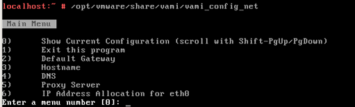

When deploying the VMware vCenter Server Appliance (VCSA) it will default look for a DHCP address. When there is no DHCP server available the following error is displayed:

> O NETWORKING DETECTED.

it is possible to manually configure a static IP address by using the command line. Here are the steps:

- Open a console session of the VCSA 
- Login as: **root**
- Default password is: **VMware**
- Execute the following command:

`/opt/vmware/share/vami/vami_config_net`

- After executing the command, a menu is displayed. Within the menu It is possible to change the IP address, hostname, DNS, Default gateway and proxy server.

- After allocate a static IP Address to the VCSA the post configuration can be done by using the following URL: 

`https://static-ip-address:5480`