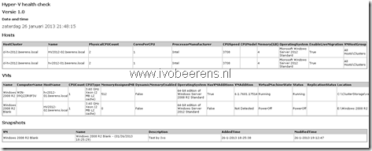

Last week I created a simple example of a HealtCheck PowerShell script that connects to Microsoft System Center Virtual Machine Manager and displays information about the Hyper-V hosts and VMs managed by this server.

I run the PowerShell script  from another Windows Server 2012 host. To make this work make sure the Hyper-V manager and the VMM Console is installed on the server. The VMM console can be installed from the Microsoft System Center 2012 Virtual Machine Manager ISO.

The output is displayed on the screen and exported to a HTML file. The following information is generated:

**Host information:**

Cluster it belongs, host name, CPU count, core count, CPU speed, CPU model, memory, operating System, and VM hostgroup

**VM information:**

VM name, computer name, host the VM is on, CPU count, CPU type, memory, if dynamic Memory is enabled, Operating System, If integration tools are installed, integration tool version, VM status, Replication Status and VM location

**VM snapshot information:**

VM Name, Name of the snapshot, description, time added and modified time

Here is an example how the output looks like:



The only parameter that needs to be changed is the **$File** variable that specify the location were the HTML file is stored.

**PowerShell script:**

```powershell
<#
.SYNOPSIS
  System Center Virtual Machine Manager Healthcheck 
.VERSION
1.0
.DESCRIPTION
  Generates a HTML Healthcheck report 
.NOTES
  Author(s): Ivo Beerens 
.EXAMPLE
  PS> ./scvmmhc.ps1
#>

# Import modules
Import-Module -Name "Hyper-v"
Import-Module -Name "VirtualMachineManager"

#Variables
$Date = Get-Date
$Datefile = ( get-date ).ToString('yyyy-MM-dd-hhmmss')
$File = New-Item -type file "D:\Temp\Healtcheck_$datefile.html"

#Connect to the SCVMM server
Clear
$VMMName = Read-Host "Enter System Center Virtual Machine Server Name to check"
Write-Host "VMM name is $VMMName" -ForeGround Red 
Get-VMMServer -ComputerName $VMMName

#HTML
# Add Text to the HTML file 

Function Create-HTMLTable
    {
    param([array]$Array)
    $arrHTML = $Array | ConvertTo-Html
    $arrHTML[-1] = $arrHTML[-1].ToString().Replace('</body></html>',"")
    Return $arrHTML[5..2000]
    }

$output = @()
$output += '<html><head></head><body>'
$output += 
'<style>table{border-style:solid;border-width:1px;font-size:8pt;background-color:#ccc;width:100%;}th{text-align:left;}td{background-color:#fff;width:20%;border-style:so
lid;border-width:1px;}body{font-family:verdana;font-size:12pt;}h1{font-size:12pt;}h2{font-size:10pt;}</style>'
$output += '<h1>Hyper-V health check</h1>'
$output += '<h1>Versie 1.0</h1>'
$output += '<h2>Date and time</h2>',$date

# Hosts
$HVHosts = Get-VMHost | Select HostCluster,Name,PhysicalCPUCount,CoresPerCPU,ProcessorManufacturer,CPUSpeed,CPUModel,@{N="Memory(GB)";E={[math]::Round((($_.TotalMemory)/1GB),3)}},OperatingSystem,EnableLiveMigration,VMHostGroup
$output += '<p>'
$output += '<h1>Hosts</h1>'
$output += '<p>'
$output += Create-HTMLTable $HVHosts
$output += '</p>' 

# VM
$VMs = Get-VM | Select Name,ComputerName,HostName,CPUCount,CpuType,MemoryAssignedMB,DynamicMemoryEnabled,OperatingSystem,HasVMAdditions,VMAddition,VirtualMachineState,Status,ReplicationStatus,Location
$output += '<p>'
$output += '<h1>VMs</h1>'
$output += '<p>'
$output += Create-HTMLTable $VMs
$output += '</p>'

# Snapshots
$VMSnaps = Get-VM | Get-VMCheckpoint | Select VM,Name,Description,AddedTime,ModifiedTime 
$output += '<p>'
$output += '<h1>Snapshots</h1>'
$output += '<p>'
$output += Create-HTMLTable $VMSnaps
$output += '</p>'

# End
$output += '</body></html>'    
$output | Out-File $file -Force

# Open the HTML file
ii $file
```

The script can be easily extended with other checks, for example an e-mail option. If you have other additions let me know so the script can be extended.