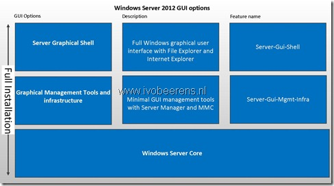

In Windows Server 2012 you can choose between a Server Core and Server with a GUI (full) during the installation. The Full Server GUI has all the tools and options to configure and troubleshoot. Server core is a minimal Windows installation with less tools and options.

**Server Core has the following advantages over Server Full**:

- Smaller footprint (disk and memory).
- It is more secure because the smaller attack surface.  For example the Server core version has no Internet Explorer included. So no IE patches are needed to install.

**Server Core d**isadvantages over Server Full**:**

- Configuration, management and troubleshooting can be more complex. For example when you want to change the binding order and NIC order you need to use PowerShell or Netsh commands.

In Windows Server 2008 R2 you cannot switch between Server core and Server with the full GUI. With Windows Server 2012 it is possible to switch between a Server Core and Server Full as needed. Switching between Server core and Server Full **requires a reboot**.

In Windows Server 2012 there are three GUI options to configure:

- **Server Core.**  Includes the sconfig menu and PowerShell. It can be managed by RDP and Server Manager and MMC remotely.

![image_thumb[2]](images/image_thumb2_thumb.png "image_thumb[2]")

- **Graphical Management Tools and Infrastructure**. Provides a minimal server interface and server management tools such as Server Manager and the Microsoft Management Console (MMC).

![image_thumb[3]](images/image_thumb3_thumb.png "image_thumb[3]")

- **Server Graphical Shell**. This is the full installation including Server Manager, MMC, Internet Explorer and Windows Explorer.

![image_thumb[4]](images/image_thumb4_thumb.png "image_thumb[4]")

#### Use case  switching between Server Core and Server with a GUI (full) and vise-versa

When configuring the Hyper-V role with multiple NICs it can be difficult to optimize (for example NIC and binding order)  the NIC configuration in Server Core.

![image_thumb[5]](images/image_thumb5_thumb.png "image_thumb[5]")

To make it easier to do the configuration you can begin the installing and configuring of the Windows Server 2012 in full GUI mode. After the configuration is completed you can switch to Server Core back. Another case to switch to the Server Full GUI is during troubleshooting.

#### Switch between Server Core and Server with a GUI (full)

Switching between the GUI modes can be via Server Manager and PowerShell. Microsoft Hyper-V Server 2012 stand-alone (free) version does not support switching between the Server Core and Server GUI!

**Server Manager**

In Server Manager you can add or remove the Graphical Management Tools and Infrastructure or the Server Graphical Shell (full) feature.

![image_thumb[1]](images/image_thumb1_thumb.png "image_thumb[1]")

**PowerShell**

Here are some PowerShell examples that can be used:

List Server roles beginning with Server*

`Get-WindowsFeatures Server*`

Switch from Core Server to the Server Full

`Install-WindowsFeature Server-Gui-Mgmt-Infra,Server-Gui-Shell –Restart`

Switch from Server full to Core Server

`Remove-WindowsFeature Server-Gui-Mgmt-Infra,Server-Gui-Shell –Restart`