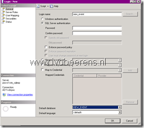

The event database record information about View Manager events. Without configure the event database events are logged in a log file. The log file has very limited information. So configuring the Event Database in the View environment is a best practice.

In Proof of Concept (PoC) environments MS SQL Server Express can be used for the Event database. This procedure describes how-to create a event database by using an MS SQL Server Express database:

- Install the Microsoft SQL Server Management Studio. For more information see my earlier blog post  [link](https://www.ivobeerens.nl/2011/12/08/add-sql-server-management-studio-to-microsoft-sql-server-express-2008-r2/)
- Make sure the SQL server authentication is set to SQL and Windows Authentication mode
- Create a new database in Microsoft SQL Server Management Studio (There is no ODBC data source connection needed!).
- Create a new user using SQL Server authentication, disable enforce password policy and select as default database the event database.
- In the User Mapping field, map de the database and add the role **db\_owner** to the new user

|  |  |
|---|---|

- Open the SQL Server Configuration Manager > SQL Server Network Configuration > Protocols for VIM\_SQLEXP,  open the TCP/IP protocol and make sure it is enabled. Scroll down to IPAll and write down the TCP Dynamic Ports number

- Disable Windows Firewall on the SQL server machine. If you are unable to do this, set a Firewall exception for the dynamic port listed
- In the View Administrator (https://connectionserver/admin) select View Configuration > Event Configuration. In the Event Database section click Edit and enter the information needed.

|  |  |
|---|---|

And the Event database is configured with MS SQL Server Express.