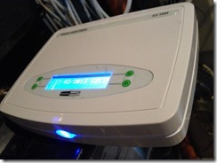
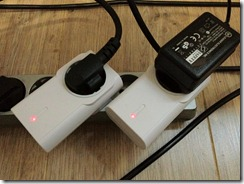
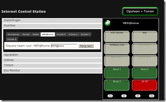
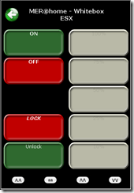

I have a lab at home to test for example VMware vSphere and Microsoft stuff. Running your home lab for 24/7 will result in a high electricity bill. For a couple of months I use the Internet Control Station ICS-1000 (ICS-1000) to power on my home lab when needed from **anywhere**. The ICS-1000 controls (left picture) controls the receivers (right picture). The ICS-1000 is connected to my router. In the receivers are the power cables plugged from the devices you manage.

<table border="0" cellspacing="0" cellpadding="2" width="400"><tbody><tr><td valign="top" width="200"></td><td valign="top" width="200"></td></tr></tbody></table>

So when needing my lab environment I  open the App on my iPhone and power on the home lab  from everywhere. After a short time I can remotely access the home lab and connect for example to my:

- NAS
- VMware vSphere with ESXi servers environment
- Microsoft Hyper-V environment

Using the web browser or the iPhone App for example you can program the timers to power on/off devices on specific times and dates.   

<table border="0" cellspacing="0" cellpadding="2" width="400"><tbody><tr><td valign="top" width="200"></td><td valign="top" width="200"></td></tr></tbody></table>

I use different receivers through  the whole house and control it with the ICS-1000.  For example I control the light outside the house with timers I programmed in the the ICS-1000. The App has still some limitations and bugs.  For example it is not possible to edit timers.  To change the timers you need to delete and recreate them. Probably in March 2013 the App will be updated to solve some bugs and add new functionality.