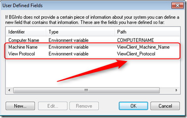
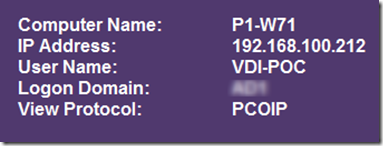

Systinternals has a tool called “BgInfo”. With this tool it is possible to display content on a Windows desktop background. For example environment variable Information such as “computer name” and the “IP address” can be displayed. This can be very handy when testing or for people that do they support for the Windows environment.

VMware View 5.1 has the following environment variables available in a desktop session :

- ViewClient\_Broker\_DNS\_Name
- ViewClient\_Broker\_DomainName
- ViewClient\_Broker\_Remote\_IP\_Address
- ViewClient\_Broker\_Tunneled
- ViewClient\_Broker\_Tunnel\_URL
- ViewClient\_Broker\_URL
- ViewClient\_Broker\_UserName
- ViewClient\_IP\_Address
- ViewClient\_LoggedOn\_Domainname
- ViewClient\_LoggedOn\_Username
- ViewClient\_Machine\_Name
- ViewClient\_MAC\_Address
- ViewClient\_Protocol
- ViewClient\_Type
- ViewClient\_Windows\_Timezone

The View environment variables can be added to BgInfo using the custom field option.

After running BgInfo, the View environment variables are displayed on the desktop background. In the following example we added information on the desktop about what protocol (RDP or PCoIP) is used  to connect to the View desktop:

