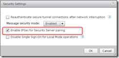
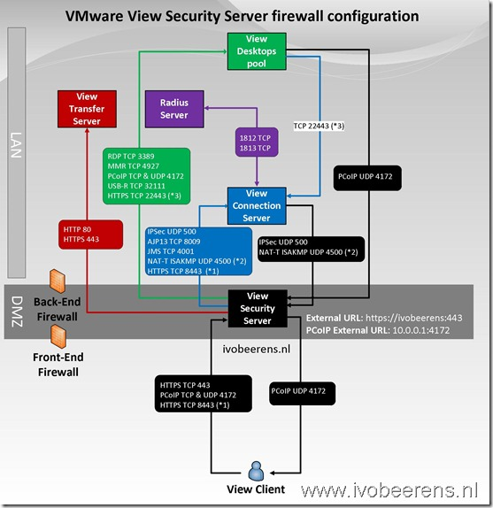

A security server is a special instance of View Connection Server that runs a subset of View Connection Server functions. You can use a security server to provide an additional layer of security between the internet and your internal network. A security server resides within a DMZ and acts as a proxy host for connections inside your trusted network.

Setting up a VMware Horizon View Security server can be a challenging task because you have to deal with firewalls and some ports that's need to be opened between the servers. Here are some tips for implementing a VMware Horizon View Security server:

- A Security server resides within a DMZ
- The security server is not a member of the Active Directory
- Create or obtain a signed certificate for the Security Server from a  trusted Certificate Authority. More information about the certificate options can be found [here](http://pubs.VMware.com/view-52/index.jsp?topic=%2Fcom.VMware.view.planning.doc%2FGUID-5CC0B95F-7B92-4C60-A2F2-B932FB425F0C.html).
- To allow tunneling of the PCoIP protocol from the Security Server  to a Connection Server, configure the PCoIP Secure Gateway. More info can be found [here](http://communities.VMware.com/docs/DOC-14974)
- Verify that Windows Firewall with Advanced Security is set to on in the active profiles. It is recommended that you turn this setting to on for all profiles. By default, IPsec rules govern connections between security server and View Connection Server and require Windows Firewall with Advanced Security to be enabled
- Back-end firewalls must be set up to support IPsec. If you have a back-end firewall between security servers and View Connection Server instances, you must configure firewall rules to allow the connections to work. More information: See "Configuring a Back-End Firewall to Support IPsec " in the View Installation guide.
- Windows Firewall with Advanced Security must be enabled on Security Server and View Connection Server hosts.  By default, IPsec rules govern connections between the View security server and View Connection Server and require Windows Firewall with Advanced Security to be enabled.  Best choice: Set Windows Firewall with Advanced Security to on before you install the View servers. Make sure it's on for any active profiles; better still, set it to on for all profiles.  Alternative: Before you install security servers, open View Administrator and disable the Global Setting, Use IPsec for Security Server Connections, by setting it to no. (This is not recommended.)

- The firewall rules that needs  to  be used can be found [here](http://pubs.VMware.com/view-52/index.jsp?topic=%2Fcom.VMware.view.planning.doc%2FGUID-5CC0B95F-7B92-4C60-A2F2-B932FB425F0C.html). I made a drawing (based on VMware Horizon View Security server version 5.2) of a single View Security server that list the ports and rules that needs to be opened between the servers:

**(\*1)** HTML Access uses TCP port 8443 for client connections to the Blast Secure Gateway

**(\*2)** Enable this port for firewalls that use NAT. For non-NAT firewalls use the ESP protocol.

**(\*3)** Enable this port  if you use VMware Horizon View HTML Access, security servers connect to View desktops on HTTPS port 22443 to communicate with the Blast agent.