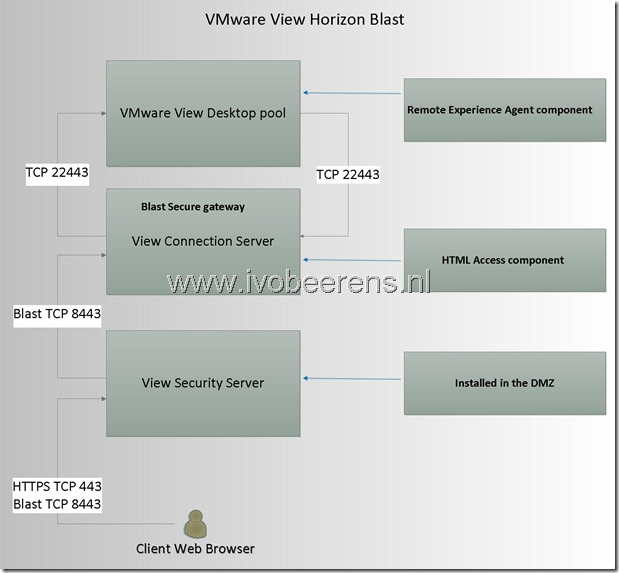
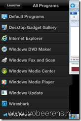

With the release of the **VMware Horizon View Feature Pack 1** for VMware Horizon View 5.2 it possible to connect with HTML5 to your View desktop. This without installing additional software. The new HTML5 protocol is called Blast. Connecting by using the Blast HTML protocol can be handy when you are on a device that does not have the VMware View client installed.

The VMware Horizon View Feature Pack 1 contains the following two main components:

- **Remote Experience Agent installer**
- **HTML Access installer**

**Remote Experience Agent installer** contains:

- HTML Access Agent: The HTML Access Agent allows users to connect to Horizon View desktops by using HTML Access
- Unity Touch: With Unity Touch, tablet and smart phone users can easily browse, search, and open Windows applications and files, choose favorite applications and files,and switch between running applications, all without using the Start menu or Taskbar. Unity touch requires a VMware View Client

This component is installed on the View Desktop (XP SP3, Windows Vista (32-bit), Windows 7 or 8 )

**HTML Access installer**: This installer configures View Connection Server instances to allow users to select HTML Access to connect to desktops. After you run the HTML Access installer, the View Portal displays an HTML Access icon in addition to the View Client icon.

This component is installed on the Blast Secure Gateway know as View Connection Server (Not the Security Server).

Here is an overview of the components and firewall ports that's needs to be opened:

A single security server can support up to 100 simultaneous connections to Web clients using the Blast protocol. For a complete list and drawing of the firewall ports that needs to be opened in a VMware View Security Server environment see my earlier post [here](https://www.ivobeerens.nl/2013/03/05/tips-for-implementing-a-VMware-horizon-view-security-server/).

In the View Administrator the connections using a the Blast protocol can be monitored:

Unity Touch is supported on the following Horizon View Client versions:

- Horizon View Client for iOS 2.0 or later
- Horizon View Client for Android 2.0 or later

Unity Touch is supported on the following mobile device operating systems:

- iOS 5.0 and later
- Android 3 (Honeycomb)

The following Web browsers are supported:

- Chrome 22 or later
- Internet Explorer 9 or later
- Safari 5.1.7 or later
- Firefox 16 or later
- Mobile Safari on iOS devices running iOS 6 or later

Don't expect: that the Blast protocol offers:

- The same performance as PCoIP!
- USB and multimedia redirection
- ThinPrint support

But the  Blast HTML protocol can be handy when you are on a device that does not have the VMware View client installed.

<table border="0" cellspacing="0" cellpadding="2" width="400"><tbody><tr><td valign="top" width="200"></td><td valign="top" width="200">&nbsp;</td></tr><tr><td valign="top" width="200">View Portal. Choose&nbsp; between the View Client or HTML access</td><td valign="top" width="200">Logon screen HTML access</td></tr><tr><td valign="top" width="200"></td><td valign="top" width="200"></td></tr><tr><td valign="top" width="200">Unity touch from iPhone</td><td valign="top" width="200">Unity touch from iPhone</td></tr></tbody></table>