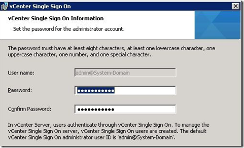

During the installation of the Windows vCenter Single Sing On (SSO) service you must provide a password for the SSO admin user named “[admin@System-Domain](mailto:“admin@System-Domain)”.

The password you enter is called the master password. If you change the master password, the password entered during the installation of the SSO service is needed as master password for resetting the “[admin@System-Domain](mailto:“admin@System-Domain)”. You can reset it by using the following syntax:

- navigate to the following directory \Program Files\VMware\Infrastructure\SSOServer\utils`
- Use the `rsautil reset-admin-password` command.  The VMware KB article can be found [here](http://kb.VMware.com/selfservice/microsites/search.do?language=en_US&cmd=displayKC&externalId=2034608).

**If you forgot the master password and have no other admin account, there is no supported way to reset the SSO password. You need to reinstall your vCenter environment!**

There is an unsupported way to recover the SSO password by reading the sha256 hashed password. The complete procedure can be found on [Schubis Blog](http://www.die-schubis.de/doku.php?id=VMware:vSphere&&_sm_au_=iVVqjkrsQ0sLqFW6).

Make sure that you document master SSO password entered during the installation. After the installation add some other users to Administrators group in SSO.  I hope VMware will make it possible to reset the “[admin@System-Domain](mailto:“admin@System-Domain)” password. in a future patch of release.