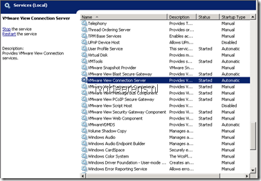

For VMware Horizon View it is recommends that you configure your VMware View Horizon Servers with a signed SSL certificate. Default when you install a VMware View Horizon servers, a certificate is generated that is not signed by a CA. Because it is not signed by a CA It is possible to to intercept traffic. So it is highly recommend to replace the default certificate with a signed certificate after the installation.

In the VMware View Horizon Administrator dashboard you can see that the Connection Server does not have a valid signed certificate.

The following steps explains how-to create a signed certificate and replace the self-signed certificate on the VMware View Horizon Connection Server(s). As CA is a Windows Server 2012 Enterprise Certificate Authority used. The installation of this CA is not part of the steps! The VMware View Horizon Connection Server(s) are installed on Windows Server 2008 R2.

#### Steps on the Windows Server 2012 Certification Authority

- Open the **Certification Authority** program in the tools section in Server Manager from the Windows Server 2012 server
- Expand the server name and right click on Certificate Template and choose **Manage**

- Select the **Web Server Template** and choose **Duplicate Template**
- Leave all the fields defaults except the following:

- In General change the **Template** **display name**, **Template name** and **Validity period** and **Renewal period** fields to your needs
- In **Request Handling**  mark **Allow private key** to be exported
- In the **Security** add the **computer account** of the View Connection Servers with the **Read, Write and Enroll** permissions checked

<table border="0" cellspacing="0" cellpadding="2" width="400"><tbody><tr><td valign="top" width="200"></td><td valign="top" width="200"></td></tr><tr><td valign="top" width="200"></td><td valign="top" width="200">&nbsp;</td></tr></tbody></table>

- Close the Certificate Templates Console
- In the Certificate Authority choose **New** – **Certificate Template to issue**  and select the Certificate Template just created

<table border="0" cellspacing="0" cellpadding="2" width="400"><tbody><tr><td valign="top" width="200"></td><td valign="top" width="200"></td></tr></tbody></table>

#### **Steps on the VMware Horizon View Connection Server(s**)

- Start – Run – MMC
- File – Add Snap-ins – Certificates – Computer Account – Local  computer
- Personal – Certificates – All Tasks – Select Request New Certificate

- Next
- Choose **Active Directory Enrollment Policy**
- Next
- **Check** the **VMware View** template and select **Properties** 

- In **subject -** Subject name Type select **Common Name**. Enter the FQDN name of the VMware View Horizon Connection server

- In General enter as Friendly name **vdm** in the field

- Check in the Private Key – Key Options field if **Make private key exportable** option is checked

- OK and press Enroll

- Rename the Friendly name of the old self signed certificate to another name as VDM

- Restart the **VMware View Connection Server** service.

- Wait some time so that the **VMware View Connection Server** can load
- Login the View Administrator portal and within a couple of minutes the dashboard System Health of the Connection Servers should get a green color. The VMware View Connection Servers has now a signed certificate

<table border="0" cellspacing="0" cellpadding="2" width="400"><tbody><tr><td valign="top" width="200"></td><td valign="top" width="200"></td></tr></tbody></table>