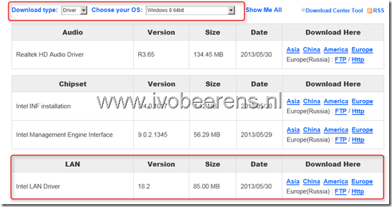
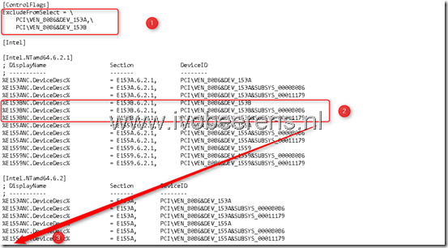
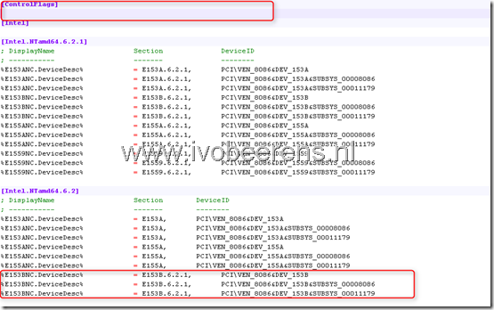
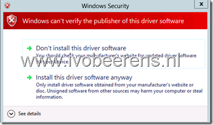
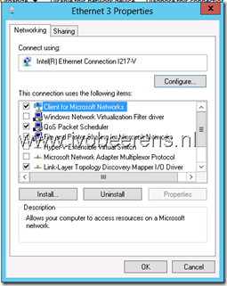

My new Gigabyte Z87-D3HP motherboard with support for 4th Generation Intel® Core™ processors (codename Haswell) has a onboard Intel I217-V NIC. The NIC is not recognized and supported in Windows Server 2012. As with the “[Enable the Intel 82579V NIC in Windows Server 2012](http://www.ivobeerens.nl/2012/08/08/enable-the-intel-82579v-nic-in-windows-server-2012/)” blogpost it is possible to enable the NIC in Windows Server 2012. Here are the steps:

- To be able to modify the drivers you need to run the the following commands:
```
bcdedit -set loadoptions DISABLE_INTEGRITY_CHECKS 
bcdedit -set TESTSIGNING ON
```
- **Reboot** the system

- Download the Intel drivers from the motherboard vendor or from Intel. In my case I used the Intel Windows 8 64-bit  drivers Gigabyte has available for the Z87-D3HP motherboard on there website.

[](images/image25.png)

- Save the drivers  and extract them
- Open the folder **PRO1000**
- Open the folder **Winx64**
- Open the folder **NDIS63**
- Open the **e1d63x64.inf** file, I used Notepad++  to edit the file
- In the **\[ControlFlags\]** section delete the 3 lines (see 1)

[](images/image26.png)

- Select and copy the three **E153B** lines ((see 2)
- Paste the 3 lines in the **\[Intel.NTamd64.6.2\]** section below the **%E155ANC** lines (see 3)
- After the modifications the **e1d63x64.inf** file must look like this:

[](images/image27.png)

- Save the file
- Install the Intel driver
- During the installation the you got a "Windows can't verify the publisher of this driver software" warning, select "Install this driver software anyway"  and continue

[](images/image28.png)

- After the installation the Intel I217-V Gigabit NIC is recognized and enabled.

[](images/image29.png)

- Enable the driver integrity checks and disable test signing again by using the following commands:
```
bcdedit -set loadoptions ENABLE_INTEGRITY_CHECKS
bcdedit -set TESTSIGNING OFF
```
- Reboot the system