I was searching for a new whitebox for my home lab. I had the following requirements for the new whitebox:

- Low power consumption for 24x7 running
- \>16 GB memory
- Expansion slots for PCI(-E) cards
- Good performance
- Low noise

A couple of weeks ago Intel released the new 4th generation Haswell CPUs that consumes less power. Seems to be interesting option for building a low power consumption whitebox. So I did some research and ordered the following hardware components:

<table width="483" border="0" cellspacing="0" cellpadding="2"><tbody><tr><td valign="top" width="139">CPU</td><td valign="top" width="130">i5 4570S Boxed</td><td valign="top" width="212"><a href="images/foto-7_thumb1.jpg">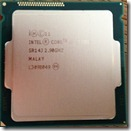</a></td></tr><tr><td valign="top" width="139">Motherboard</td><td valign="top" width="130">Gigabyte GA-Z87-D3HP</td><td valign="top" width="212">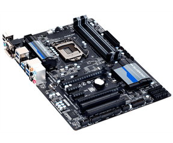</td></tr><tr><td valign="top" width="139">Memory</td><td valign="top" width="130">Corsair Vengeance 4 x 8 GB DDR3 PC3-12800 (DDR3-1600) 32GB</td><td valign="top" width="212">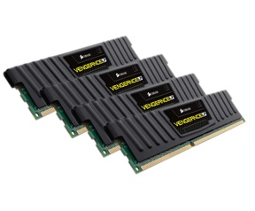</td></tr><tr><td valign="top" width="139">Power Supply</td><td valign="top" width="130">Seasonic G-360 80 Plus Gold</td><td valign="top" width="212">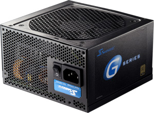</td></tr></tbody></table>

The following components I reused:

- The case
- 2 Intel PCI-e NICS
- A SSD drive

**CPU**

Haswell is the codename for the 4th generation Intel Core processors. One of the big improvements of the Haswell CPUs is the idle power consumption. The Intel S-version is also a low-power CPU.  It contains 4 cores and has a 65W TDP. The processor supports vPro, VT-x, VT-d, EPT etc.   A CPU cooler is in the box included. For the full specifications look [here](http://ark.intel.com/products/75044/Intel-Core-i5-4570S-Processor-6M-Cache-up-to-3_60-GHz).

**Motherboard**

The Gigabyte GA-Z87-D3HP is a socket 1150 motherboard. The board has  4 memory sockets that support  DDR3 memory up to 32 GB.  It has onboard graphics , 6 x SATA 6 Gb/s connectors, a Intel WG-217v LAN adapter and the following expansion slots:

- 1 x PCI Express x16 slot
- 1 x PCI Express x16 slot, running at x4
- 2 x PCI Express x1 slots
- 2 x PCI slots

**Memory**

For the memory I choose the Corsair Vengeance CML32GX3M4A1600C10 4 x 8  PC3-12800 (DDR3-1600) CL10 kit. All the four memory sockets on the board are filled with a 8 GB module (total = 32 GB memory).

**Power Supply**

The Seasonic G-360 power supply has a 80 Plus Gold certification. This is a great power supply with high efficiency and low noise..

#### Hypervisor support

I tested VMware ESXi 5.1 Update 1 and vSphere 5.5 and Microsoft Windows Server 2012 with the Hyper-V role installed.

**VMware ESXi**

The onboard Intel I217-V NIC is not recognized  by ESXi 5.1 Update 1. To get the I217-V NIC working in ESXi5.x read the blog post found [here](https://www.ivobeerens.nl/2013/09/20/enable-the-intel-i217-v-network-card-in-VMware-esxi/). I reused 2  Intel PCI-e NICs, one for LAN and the other for iSCSI and NFS traffic. The onboard SATA controller  (Lynx Point AHCI) is recognized. I use an existing SSD for booting ESXi and running some important VMs. But is is possible to boot ESXi from USB stick. The other VMs are on NAS device. Passthrough is supported by the CPU and motherboard.

<table width="400" border="0" cellspacing="0" cellpadding="2"><tbody><tr><td valign="top" width="200"><a href="images/image121.png">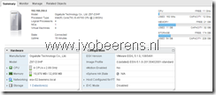</a></td><td valign="top" width="200"><a href="https://www.ivobeerens.nl/wp-content/uploads/2013/06/image151.png">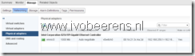</a></td></tr><tr><td valign="top" width="200"><a href="https://www.ivobeerens.nl/wp-content/uploads/2013/06/image61.png">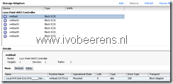</a></td><td valign="top" width="200"><a href="https://www.ivobeerens.nl/wp-content/uploads/2013/06/image91.png">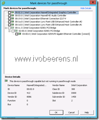</a></td></tr></tbody></table>

 **Microsoft Windows Server 2012 with the Hyper-V role**

I tested Windows Server 2012 with the Hyper-V role enabled. The The onboard Intel I217-V NIC is not recognized by default. In the "[Enable the Intel I217-V NIC in Windows Server 2012](https://www.ivobeerens.nl/2013/06/24/enable-the-intel-i217-v-nic-in-windows-server-2012/)" blog post I explain how to enable the I217-V NIC Windows Server 2012.

<table width="488" border="0" cellspacing="0" cellpadding="2"><tbody><tr><td valign="top" width="251"><a href="images/image181.png">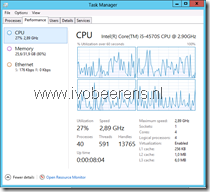</a></td><td valign="top" width="235"><a href="https://www.ivobeerens.nl/wp-content/uploads/2013/06/image221.png">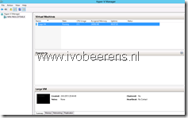</a></td></tr><tr><td valign="top" width="251"><a href="https://www.ivobeerens.nl/wp-content/uploads/2013/06/image271.png">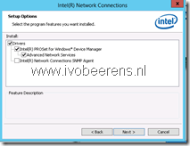</a></td><td valign="top" width="235">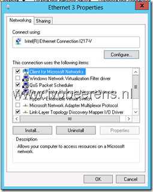</td></tr></tbody></table>

**Power consumption**

The whitebox consumes a maximum between 40-50 W. When idle (and that is often) it consumes only 28 a 29 W!

[")](images/foto-8.jpg)

The whitebox components costs about €615. and will be used for running VMs 24x7. The whitebox meets all the requirements I had.