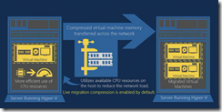
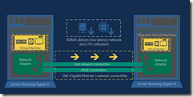
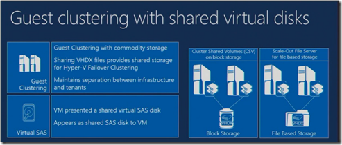

On TechEd Windows Server 2012 R2 is announced. Here are some highlights of "Hyper-V – What's New in Windows Serve 2012 R2" session (MDC-B330):

- **Windows Azure IaaS compatibility**—Windows Azure IaaS uses exactly the same virtualization as Windows Server 2012 Hyper-V. So VM's on-premise can be moved to Azure (Iaas) without problems
- **Generation 2 Virtual Machines (VMs).** In the  generation 2 VM are many emulated devices removed and it boots from virtual SCSI or synthetic network adapters. In earlier releases the VM booted from an IDE controller or a legacy network adapter. Gen 2 VM's are only supported from Windows 8 and Windows Server 2012 64-bit and higher Operating Systems. A generation 2 VM knows that it is virtualized!
- **Enhanced VM Interaction**. This is Remote Desktop over VMBUS which enables full remote desktop capabilities such as shared clipboard, copy files, audio redirection, enhanced login etc.
- **Automatic activation**. Zero touch activation of VMs.  It will check if the Hyper-V host is licensed than the VM is automatically licensed.
- **Faster Live Migration (LM).** Faster LM by using compression, improves 2x the LM time. Compression is enabled by default. SMB direct (RDMA) can be used in high-end networks that require super high-speed LMs.  As guidance use for 10 Gbit or less network compression and over 10 Gbit use SMB/ SMB direct

<table border="0" cellspacing="0" cellpadding="2" width="400"><tbody><tr><td valign="top" width="200"></td><td valign="top" width="200"></td></tr></tbody></table>

- **Online VHDX resize**. Increase and decrease the size of the virtual hard disks while the VM is running
- **Live virtual machine export / clone**. While the VM is running, it is possible to export a complete copy of the VM including the memory state and export any snapshot of a VM.
- **Zero downtime upgrade**. Upgrade from Windows Server 2012 to Windows Server 2012 R2  using the cross version live migration without downtime.
- **Linux Guest Support**. Support Full dynamic memory, online backup, online VHDX resize and new video driver for better video experience
- **Storage QoS**. With Storage QoS you can monitor the IOPS in a VM. It can be dynamically configured while the VM is running and can restrict disk throughput for overactive disruptive VMs
- **Guest clustering with shared virtual disks**. You can now do guest cluster using the same infrastructure

- **Improvements to Hyper-V replica. Finer grained control of replication** such as 30 seconds, 5 minutes and 15 minutes. With 30 seconds you never more than 1 minute behind the primary VM and useful for WAN connections with enough bandwidth.With **Extended replication** you can use a third location to replicate the VM.