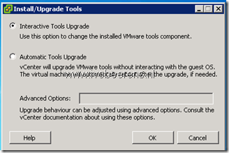
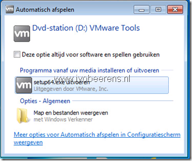
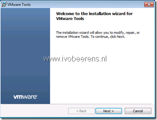
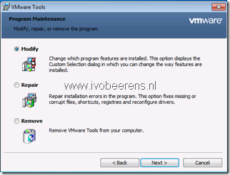
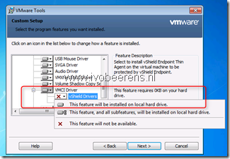

One of the steps of a vShield Endpoint based deployment is to enable the vShield driver in VMware tools. The vShield driver is not enabled by default. This can be done manually or automatically for example in the golden image of a VDI desktop.

Here are the manually steps when the VMware tools already are installed:

- In the vSphere client open a Console session
- Select VM – Guest – Install/Upgrade VMware Tools
- Choose Interactive Tools Upgrade

- In the VM open the setup program

- Choose Next

- Choose Modify

- Expand the VMCI Driver section, select vShield Drivers and select "This feature will be installed on the local hard drive"

- Next – modify

If you are installing VMware Tools in a number of Windows virtual machines, you can automate its installation by using the following syntax:

- Mount/Extract the VMware Tools ISO

`setup.exe /S /v /qn REBOOT=R ADDLOCAL=VMCI REMOVE=Hgfs`

or choose Automatic Tools Upgrade 

In the advanced Options field enter:

`/v /qn ADDLOCAL=VMCI,VShield REMOVE=Hgfs`