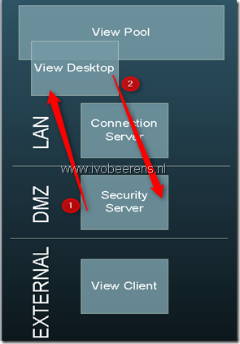

Recently I had to troubleshoot a VMware View Client connection problem. In a new VMware View environment the customer has installed a VMware Horizon View Security Server for the external connections. When a external View Client tried to connect through the Security Server using the PCoIP protocol to the View desktop the following appeared:

> The connection to the remote computer ended

When the users connects to the View Desktop using the LAN (without the Security Server) everything worked fine. I suspected that a PCoIP port (4172 TCP and UDP) is blocked between the Security Server and desktop pool or vice versa. 

To troubleshoot this problem I used the tool "Netcat". With Netcat TCP and UDP ports can be checked (Telnet can only check TCP ports). So I used Netcat to check the TCP and UDP ports between the Security server and View Desktop (1) and the View Desktop to the Security Server(2).

Here is an example how to use Netcat:

**On the View desktop run Netcat to listen to UDP port 4172**:

`nc –l –u –p 4172`