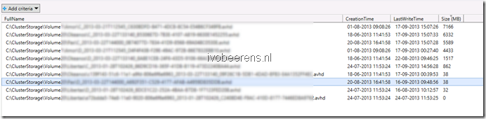

During a Windows Server 2012 Hyper-V Health Check I needed to know the snapshot file sizes for the all the snapshots on the Clustered Shared Volumes (CSVs). The Get-VMCheckpoint Cmdlet does not report the snapshot size. So I create a PowerShell one-liner that displays the following information:

- Location of the snapshot file
- Date and time that the snapshot file was created
- Last write access time of the snapshot file
- File size in MBs

The PowerShell one-liner is executed from a Hyper-V 2012 host that has access to all the  Cluster Shared Volumes (CSVs).

```
Get-ChildItem C:\ClusterStorage\ * -include *.avhd -recurse  | Select-Object Fullname,CreationTime,LastWriteTime,@{"Name"="Size (MB)"; "Expression"={[int]($_.Length/1mb)}} | Out-GridView
```

This PowerShell one-liner produces the following output: [](images/image.png)