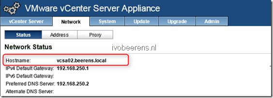

Here are some deployment tips and tricks for the VMware vCenter Server Appliance (VCSA):
- The VMware vCenter Server Appliance is a preconfigured Linux-based virtual machine. The VMware vCenter Server Appliance (VCSA) is available as OVF/ OVA
- It based on Suse Linux Enterprise 11 64-bit
- Linked Mode, Microsoft SQL or DB2 is not supported
- As database you can use the embedded vPostgres or external Oracle database
- The minimal configuration is: 2 vCPUs, 8 GB memory, a 25 GB thin provisioned and 100 GB thick disk. This configuration is for 10 or fewer hosts and 100 or fewer virtual machines. More information on sizing the VCSA can be found here link.
- In a small home lab or PoC environment you can decrease the memory of the VCSA. For example my home lab VCSA has 4 GB memory. This is not supported!
- The VCSA is deployed with  Hardware Version 7. If you update the vCenter Server appliance to hardware version 10, you cannot edit the virtual machine settings for the appliance using the vSphere Client!
- Make sure that the hostname is entered as Fully Qualified Domain Name (FQDN). 

- If you get “Error: invalid hostname. FQDN is required for joining a domain” you forgot to change the hostname of the VCSA to a FQDN.

- To configure the VCSA, use the following URL: https://IP-address-VCSA:5480 to access the  Virtual Appliance Management Interface (VAMI).
- The default user name is: root
- The default password is:  VMware
- The root password will expire after 90 days! In the Admin page of the VAMI interface it is possible to disable the root password expiration.
- The default SSO user is: [administrator@vSphere.local](mailto:administrator@vSphere.local)
- Synchronize the vCenter Server Appliance Clock with a NTP server, VMware tools or Active Directory (this option is only available if the VCSA is joined with the Active Directory).
- More information on backing up and restoring the vCenter Server Appliance (vPostgres) database use the following  [Link](http://kb.VMware.com/selfservice/microsites/search.do?language=en_US&cmd=displayKC&externalId=2034505).
- To use the vSphere Web Client use the following URL: https://IP-address-VCSA:9443/
- SSH is by default enabled. To enable or disable SSH toggle the SSH login on the Admin tab of the VAMI.
- Microsoft Sysprep files can be uploaded in the VAMI summary page. They are stored in: **/etc/VMware-vpx/sysprep/OS directory.**
- You can add additional software such as SNMP to monitor the VCSA. Adding software can be done with the “Yet another Setup Tool” (YAST).
- To monitor vCenter Server Appliance database disk usage you can use this script [Link](http://kb.VMware.com/selfservice/microsites/search.do?language=en_US&cmd=displayKC&externalId=2058187).