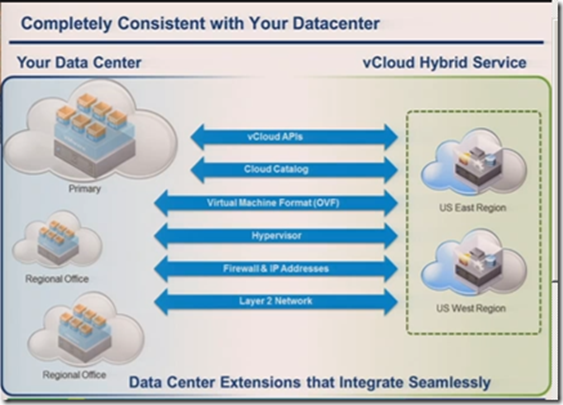
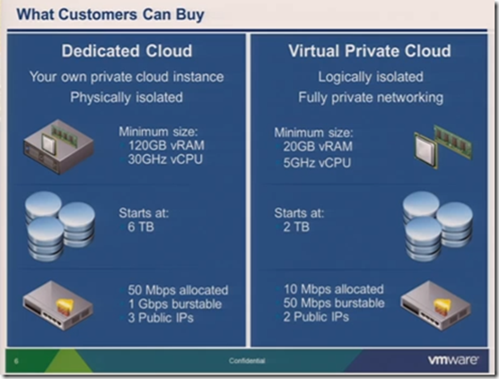

To deliver IT as a Service, VMware has for the coming year(s) the following focus areas:
- **Software-Defined Data Center (SDDC**). See the VMworld 2013 SDDC recap here [Link](https://www.ivobeerens.nl/2013/10/20/vmworld-europe-2013the-software-defined-data-center-sddc-recap/)
- **End User Computing (EUC).** See the VMworld 2013 EUC recap here [Link](https://www.ivobeerens.nl/2013/10/23/vmworld-europe-2013-end-user-computing-euc-recap/)
- **vCloud Hybrid Services (vCHS)**

In this last blog post I dig deeper in **vCloud Hybrid Services (vCHS) and DAAS**  announcements.

## Desktop-As-A-Service (DAAS)

VMware acquired Desktone to enter the Desktop-As-A-Service (DAAS) market. Desktone offers:

- **Self Service of virtual desktops.** Simple provisioning from the cloud enables self-service for IT of full VDI, shared session remote desktop service (RDS) desktops and applications without the need to procure hardware or software.
- **Multi-tenancy.** Each customer gets a separate virtual environment to ensure security while cloud providers are able to manage multiple customers under one platform.
- **Grid-based architecture for elastic scalability.** Advanced architecture enables unlimited scalability across multiple geographies and data centers.
- **Low cost of delivery.** Open source based technology eliminates Microsoft licensing fees and third-party software management, resulting in cost savings over competitive desktop virtualization offerings.

[![image_thumb6_thumb[1]](images/image_thumb6_thumb1_thumb.png "image_thumb6_thumb[1]")](images/image_thumb6_thumb1.png)

The Desktone broker can scale much larger than a VMware Horizon View broker. So it is much more suitable as multi-tenant solution. Another point is that Desktone supports multiple OSes such as Windows Server, Windows Client and Linux as VDI desktop. These desktops can be managed from a single portal, while customer have there own portal in multi-tenant environment.

With Desktone, VMware partners can offer a Desktop-As-A-Service to there customers.

## vCloud Hybrid Services (vCHS)

VMware vCloud Hybrid Service, built on VMware vSphere. This enables customers to extend the same applications, networking, management, operations and tools across both on-premises and off-premises environments (private cloud).  vCHS is the Infrastructure as a Service (IaaS) public cloud service from VMware. 

You can choose two flavors:

- **Dedicated Cloud**. This option is fully isolated. You get your own vCloud Director instance. 
- **Virtual Private Cloud**. This option runs on physical servers with VMs from other tenants. It is fully isolated from each other.

See the picture below what are the minimum starting resources:

When you choose for example a dedicate cloud you start with 30GHz vCPU, 120GB vRAM, 6 TB disk space etc. You pay for Compute, 24 x7 support, persistent disk(s) and the bandwidth you use. Services as firewalls, load balancers, VPNs, DHCP. NAT and redundancy such as HA are free.

VMware will offer a private beta of vCloud Hybrid Service in the United Kingdom  (Slough) in Q4, with general availability (GA) planned in Q1 2014.

## VMware vCloud Management Marketplace (CMM)

VMware vCloud Management Marketplace (CMM) is a single place were VMware and partners can put there solutions such as Orchestration Plug-ins, Management Packs, Blueprints and Content Packs . Customers can browse and download these tested and validated solutions in there environment.