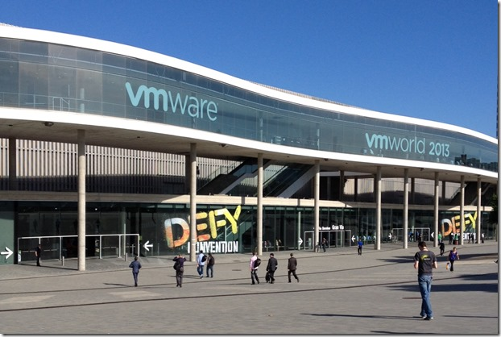
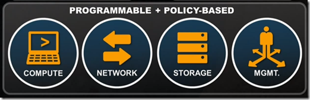
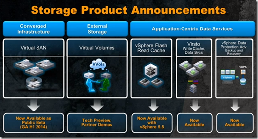
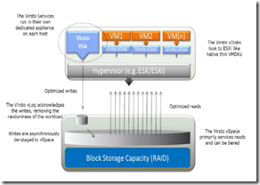
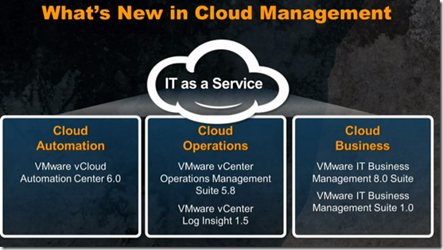
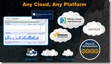
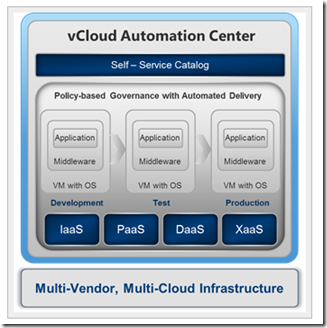
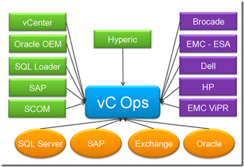
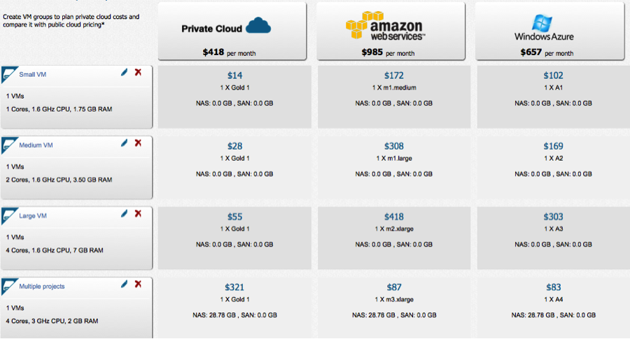

Last week i attended VMworld Europe in Barcelona. The theme was "Defy Convention". Here's an overview of the VMware focus for the coming year(s):

It's all about delivering IT as a Service.   IT as a Services gives the following answers:

- On-demand access to any device;
- Cost transparency;
- Any cloud, any platform;
- Programmable and automated infrastructure.

To deliver IT as a Service VMware has for the coming year(s) the following focus areas:

- **Software-Defined Data Center (SDDC)**
- **End User Computing (EUC)**
- **vCloud Hybrid Services (vCHS)**

In this blog post I dig deeper in the  Software-Defined Data Center (SDDC). In the next blog posts I will cover the other focus areas.

### Software-Defined Data Center (SDDC)

The SDDC is about virtualization across the entire Data Center. The Software-Defined Data Center consist of the following components:

- **Compute**
- **Network**
- **Storage**
- **Management**

### Compute

The compute layer is built on the new vSphere 5.5 platform.  Some improvements of the vSphere 5.5 platform are:

- ESXi host scalability improvements (2x increase with ESXi 5.1) such as 320 Logical CPUs, 16 NUMA nodes and 4 TB of RAM.
- Web Client improvements such as better performance, OS X support and drag and drop functionality.
- Single Sign-On (SSO) improvements.
- vCenter Server Appliance (vCSA) now ready for production environments
- vSphere Flash Read Cache. Accelerate read IOs of VMs by using local flash storage
- Support for 62 TB VMDK. NFS and vRDM
- Application High Availability (App HA).  App HA protects apps running inside the VMs  such as MS SQL and IIS.

vSphere Flash Read Cache and Application High Availability (App HA) will require a vSphere Enterprise Plus license. For more information on the new and improved features, see the "What's New in VMware vSphere 5.5 Platform" PDF. [Link](http://www.VMware.com/files/pdf/vSphere/VMware-vSphere-Platform-Whats-New.pdf)

### Network

For the network in the SDDC VMware announced the General Availability (GA) of NSX.  VMware acquired Niciria  and rebranded it to NSX. NSX is all about network virtualization. The NSX network is created in software but look like physical networks.  It's not only for ESXi but for any hypervisor. NSX works with the existing network infrastructure. Capabilities are:

- Switching L2
- Routing L3
- Firewall
- Load Balancer
- VPN
- Support for partner eco-system additions

NSX gives you the flexibility do deploy a multi tier network with software. You are able to save, delete, restore and move it, just like you do for VMs.  Interested customers should contact their VMware representative who can put them in touch directly with a VMware NSX specialist. More information about NSX can be found here [link](http://www.VMware.com/products/nsx/#2609166141001).

### Storage

VMware has the following announcements made on Software-Defined Storage:

**Virtual SAN (VSAN)**

VSAN aggregates all the local storage (spinning disk) in the cluster and creates a shared storage array. With the use of flash disks, read and writes can be accelerated.  When an ESXi host is offline the data is still available on another node. It is fully compatible with High Availability (HA) , DRS, vMotion and SvMotion. VSAN will probably GA in H1 2014 and will supports up to 16 nodes. The minimum of 3 ESXi nodes is needed. It can be scaled-out by adding extra nodes. A use case of VSAN is VMware Horizon View VDI environments.

More information see the "What's New in VMware Virtual SAN (vSAN)"  [Link](http://www.VMware.com/files/pdf/products/vsan/VMware_Virtual_SAN_Whats_New.pdf).

Try the Public Beta of VSAN? Link 

**Virtual Volumes (VVOL)**

With VVOL existing SAN/NAS systems become VM-aware.  Operating such as snapshots, replication, caching, encryption and de-duplication  can be done at VM level. VVOL must be supported by the storage hardware. VVOl is available as Technical Preview by storage partners.

**vSphere Flash Read Cache (vFRC)**

vFRC accelerates read IOs of VMs by using local flash storage. It is available in vSphere 5.5.

**Virsto**

Virsto is a software-only solution to deliver predictable performance in existing SAN systems. It delivers high performant VM-centric data services.

Virsto sits on each host and presents a virtual storage appliance (VSA) to the VMs on the host.  The VMs see Virsto as a new storage mount point, which means Virsto is in the I/O path for the VMs.  Virsto offloads the I/O from the Hypervisor in a more efficient manner.   Virsto will perform a set of actions on the random I/O so it is sequentialized and sent to the block storage layer in orderly, logical blocks. Further it can do high performance snapshots and clones of VMs or VMDKs. Virsto is now available.

**vSphere Data Protection Advanced (VDPA)**

VMware vSphere Data Protection 5.5 Advanced (VDPA) is now available. It's a backup and recovery solution based on EMC Avamar.  Version 5.5 has new features such as backup data replication, integration with EMC Data Domain, automatic backup verification.  The smaller bother VMware vSphere Data Protection (VDP) is included in vSphere Essentials Plus an higher but has a lot of limits such as 2 TB backup store and 100 VMs per appliance.  With VDPA VMware will compete against other virtualization backup and recovery solutions such as  Veeam Backup & Recovery and PHD Virtual.

### Management

On the Cloud Management layer the following products are announced:

**vCloud Automation Center (vCAC) 6.0**. 

VMware acquired the company "DynamicOps" last year and rebranded it as vCAC. vCAC is all about automating, building, deploying and managing application catalogs. 

<table cellspacing="0" cellpadding="2" width="400" border="0"><tbody><tr><td valign="top" width="200"></td><td valign="top" width="200"></td></tr></tbody></table>

By using self-service catalogs users request and manage multi-vendor, multi cloud applications.  There are three versions of vCAC available: standard, advanced and enterprise. 

For more information watch the vCloud Automation Center Overview video, [link](http://www.VMware.com/products/vcloud-automation-center/#2431280120001).

**VMware vCenter Operations Management Suite 5.8**

The new version of the vCenter Operations Management Suite can monitor heterogeneous environments.

Some examples of new capabilities are:

- Storage Analytics such as Out Of The Box (OOTB) dashboards, physical storage and HBA, fabric and array visibility
- Hyper-V support. A dashboard with Top 25 (CPU, memory, networking and disk, IOPS), datastore capacity and performance and load heatmaps by using SCOM or Hyperic
- OOTB dashboard for Microsoft SQL and Exchange and support for Microsoft Clustering
- Amazon AWS support.

An overview of the new 5.8 capabilities can be found here. [Link](http://blogs.VMware.com/management/2013/10/announcing-VMware-vcenter-operations-management-suite-5-8.html)

**VMware vCenter Log insight**

VMware vCenter Log insight delivers automated log management through aggregation, analytics and search, enabling operational intelligence and enterprise-wide visibility in dynamic hybrid cloud environments.  VMware vCenter Log Insight is the VMware answer to a product like [Splunk](http://www.splunk.com/).  vCenter Log Insight 1.5 is announced.

VMworld 2013 attendees and partners can get 5  free licenses for VMware vCenter Log Insight. [Link](http://info.VMware.com/content/23713_VMworld_LogInsight?src=&xyz=&cid=)

**VMware IT Business Management Suite (ITBM)**

The VMware IT Business Management Suite provides transparency and control over the costs and quality of IT services, enabling CIOs to align IT with business priorities.  With the IT Business Management (ITBM) option you can for example you can compare the cost cloud service providers.

These components and products will form the SDDC.