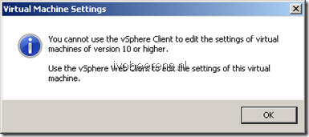

**UppubDate: 09-09-2014**: Today VMware released a new vSphere Client (vSphere Windows client). With vSphere Client 5.5.0 Build 1993072 (available with ESXi 5.5 Update 2) it is possible to edit hardware version 10 VMs settings. When editing a hardware version 10 VM it is only possible to edit hardware version 8 features. If you want to edit the advanced VM settings available in higher hardware versions you need to use the vSphere Web Client.

VMware ESXi 5.5 and vSphere Hypervisor 5.5 it is possible to upgrade the Virtual Machine to hardware version 10. The vSphere Client cannot edit settings of VMs that have hardware version 10. When you try to edit a hardware version 10 in the vSphere 5.5 client the following warning appear:

> You cannot use the vSphere Client to edit the settings of virtual machines of version 10 or higher…….

To edit settings of a version 10 VM you need the VMware vSphere Web Client! vSphere Hypervisor 5.5 does not come with the VMware vSphere Web Client, so don't use version 10 with the vSphere Hypervisor 5.5 else you are unable to edit the settings of a VM! Hardware Version 10 is only compatible with ESXi 5.5 and later.

So make sure:

- Don't upgrade to hardware version 10 on vSphere Hypervisor 5.5 (free version of ESXi)
- Only upgrade the hardware of a VM if you need the new features
- Make always a snapshot before upgrading the hardware version. You can always get back to the old hardware version.

You can downgrade the Virtual Machine hardware version by using VMware Converter Standalone for example (found [here](https://my.VMware.com/web/VMware/evalcenter?p=converter)).

A note to VMware: disable the option to upgrade to hardware version 10 from the vSphere Client in the next update. This saves a lot frustration!