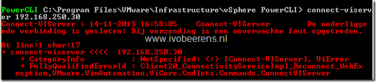

In my lab environment I still have a Windows XP with the vSphere Client 5.5 installed. When I try to connect with the vSphere Client or vSphere PowerCLI it faisl to connect to the vCenter Server 5.5 or vCenter Server Appliance (VCSA) 5.5. The following errors appears (The OS has a Dutch language installed):


PowerCLI error:



In the release notes of vSphere 5.5 this is a known issue:

> vSphere 5.5 uses the Open SSL library, which, for security, is configured by default to accept only connections that use strong cipher suites. On Windows XP or Windows Server 2003, the vSphere Client and vSphere PowerCLI do not use strong cipher suites to connect with vCenter Server. The error No matching cipher suite is shown on the server side, and the handshake fails on the vSphere Client or vSphere PowerCLI side.

There are three workarounds for this:

- Using Windows hotfixes on the Windows XP / 2003 OS
- Adjusting the vCenter Server configuration
- Adjusting the vCenter Server Appliance (VCSA) configuration

In the following steps I will  adjust the vCenter Server Appliance configuration:

- Open a SSH connection to the VCSA
- login the appliance (by default this is root and with the passsword `VMware`)
- Navigate to the `/etc/VMware-vpx` directory
- Edit the `vpxd.cfg` file with for example the VI editor (i = insert)
- Add the following `<cipherList>ALL</cipherList>` between the `<ssl>` section (see screenshot below):

```
<ssl>  
...  
...  
</ssl>
```


- Save the changes and quit the VI editor  (wq!)
- Restart the vCenter Server service by using the following command: `service VMware-vpxd restart`

After the modification I was able to use the vSphere Client and PowerCLI to connect to the vCenter Server Appliance.


For more information see KB article 2049143 found here, [link](http://kb.VMware.com/selfservice/microsites/search.do?language=en_US&cmd=displayKC&externalId=2049143)