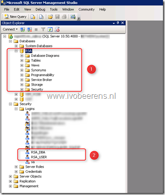

With vCenter Single Sign-On (SSO) 5.5 there is no requirement for a SQL database anymore. SSO 5.5 uses a own VMware Directory Service (VMdir) database. So after the upgrade to SSO 5.5, the Single Sign-On 5.1 database and users can be removed. This is a manual process. In SQL Management Studio remove the SSO (RSA) database and the “ RSA_DBA” and “ RSA_USER” users created.

