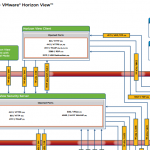

VMware has released a Network Port Diagram diagram for VMware Horizon View 5.2.

This diagram covers an entire VMware View environment with protocols and port numbers used. In earlier blog posts I already create two small diagrams with protocols and port numbers used by VMware View:
- VMware Horizon View and HTML access (Blast protocol). [Link](https://www.ivobeerens.nl/2013/03/20/VMware-horizon-view-and-html-access-blast-protocol/)

The  diagram created by VMware can be handy when implementing and troubleshooting VMware Horizon View.