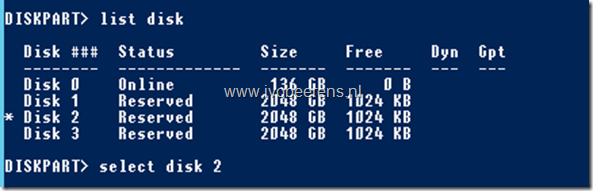
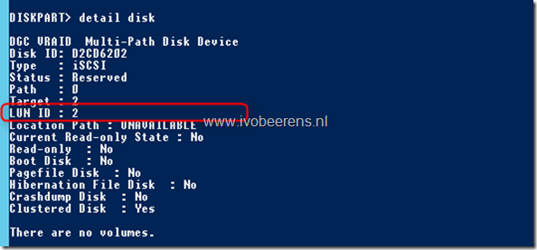

During a Windows Server 2012 R2 Hyper-V implementation I needed to identify all the iSCSI disks (LUNs) presented by an EMC VNX SAN to the Hyper-v Failover cluster. Each presented iSCSI disk has a unique LUN ID. To View the LUN ID of a disk, you can use the **diskpart** command. Here are the steps to view the LUN ID of a disk:

- **View the disks**

`list disk`

- **Select a disk**

`select disk <number>`

- **View the LUN ID of the disk**

`detail disk`

I didn't find a PowerShell command to view the LUN IDs. You can create a PowerShell script that uses Diskpart to view all the disks and the corresponding LUN IDs.