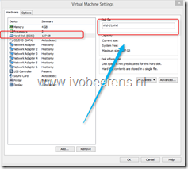
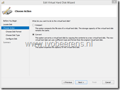
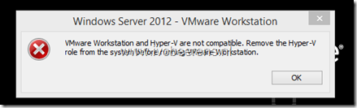

For testing I use Hyper-V and VMware Workstation 10 on my laptop. One restriction of VMware Workstation is that it does not support VHDX disk files (yet). VMware Workstation support VHD files, so the VHDX files must be converted to a VHD first. After the conversion VMware Workstation can select the VHD as Hard Disk. This can takes some time.

<table border="0" width="400" cellspacing="0" cellpadding="2"><tbody><tr><td valign="top" width="200"></td><td valign="top" width="200"></td></tr><tr><td valign="top" width="200">1. VHD disk</td><td valign="top" width="200">2. Convert options in Hyper-V</td></tr></tbody></table>

That's why I use Hyper-V on my laptop sometimes. When trying to start VMware Workstation the following error appears:

> VMware Workstation and Hyper-V are not compatible. Remove the Hyper-V role from the system before running VMware Workstation.

This is because the Hyper-V role is installed and this conflicts with VMware Workstation. To disable Hyper-V from starting the following command can be used:

`bcdedit /set hypervisorlaunchtype off`

A reboot of of the Windows OS is necessary.

To enable the Hyper-V role again use the following command:

`bcdedit /set hypervisorlaunchtype auto`

A reboot of of the Windows OS is necessary.