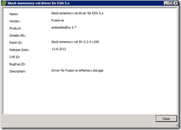
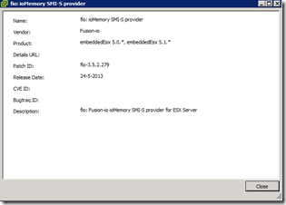
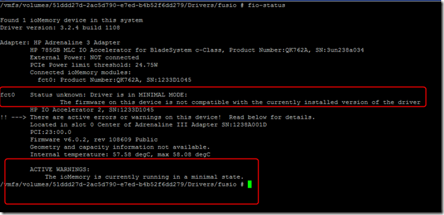
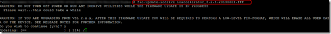
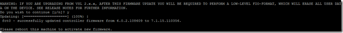
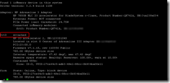
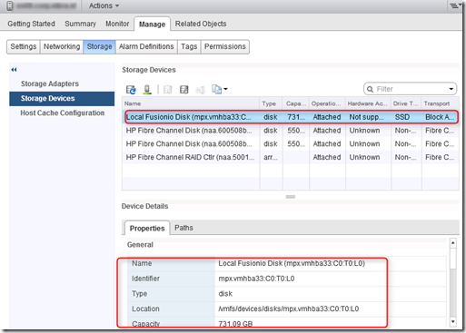

Last week I did a VMware vSphere and VMware View 4 to 5 upgrade. The ESXi servers for the VMware View environment uses Fusion-IO (HP IO Accelerators) PCI flash cards for there non-persistent VDI pools. After the upgrade to vSphere 5.1 I imported the latest Fusion-IO drivers and created a baseline in vSphere Update Manager (VUM) and deployed the new drivers to the cluster.

<table width="400" border="0" cellspacing="0" cellpadding="2"><tbody><tr><td valign="top" width="200"></td><td valign="top" width="200"></td></tr></tbody></table>

After the installation of the Fusion-IO drivers on the ESXi hosts, the Fusion-IO card was not listed in the vSphere (Web) client. Via SSH I make a connection the the ESXi servers. When i run the **fio-status** command the following warning appeared:

> Driver is in Minimal mode: The firmware on this device is not compatible with the currently installed version of the driver.
> 
> ACTIVE WARNINGS: The ioMemory is currently running in a minimal state.

The warning means that the firmware needs to be upgraded. I uploaded the firmware to a central datastore and run the following command:

`fio-update-iodrive firmwarefilename.fff`

When the firmware upgrade completed, the ESXi servers needed to restart.

After the rebootI checked the status with the **fio-status** command again.  The Fusion-IO card is out of minimal mode.

After the firmware upgrade the Fusion-IO card is listed again.