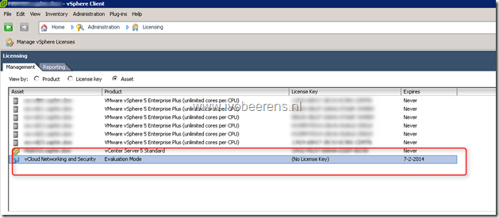

A customer has a VMware vSphere 5.1 environment with VMware Horizon View 5.2 environment and Trend Micro Deep Security installed. Trend Micro Deep Security uses the VMware vShield Endpoint framework. In the vSphere license manager asset the "vCloud Networking and Security" license is displayed in evaluation mode and has a expire date.

This is strange because vSphere 5.1 > includes a vShield Endpoint license. So no extra vShield licenses are required. I found a [KB](http://kb.VMware.com/selfservice/microsites/search.do?language=en_US&cmd=displayKC&externalId=2036875) about vShield Endpoint. It states:

> The vShield Endpoint asset may show up as unlicensed or with an evaluation license in the vCenter Server console, but functionality is fully enabled.

So you don't have to worry that vShield Endpoint stops working. This is by design and will probably fixed in a later version.