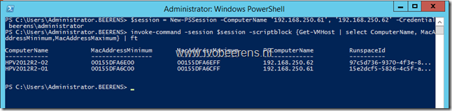

When enabling the Hyper-V role on a Windows 2012 (R2) server, it creates a dynamic MAC address pool of 256 MAC addresses available for VMs. The MAC Address Pool configuration can be found in the Virtual Switch Manager under the Global Network Settings.

[![image[16]](images/image16_thumb.png "image[16]")](images/image16.png)

The MAC address pool is generated as follows:

- The first three octets are Microsoft's IEEE organizationally Unique Identifier, 00:15:5D (which is common on all Hyper-V hosts)
- The next two octets are derived from the last two octets of the server's IP address
- The last octet is automatically generated from the range 0x0 - 0xFF. This gives 256 MAC addresses

As you can see the MAC Address pool creation depends on the IP Address used during the installation of the Hyper-V role. In this example (screenshot above) the IP address was xxx.xxx.250.108 during the Hyper-V role installation. This IP address was assigned by a DHCP server with a short lease time. After enabling the Hyper-V role a static IP address was assigned. This does not change de MAC address pool anymore.

When installing the Hyper-V role on  another server, the server received the same IP address. This results in the same MAC address pool on both servers which means that VMs gets duplicate MAC addresses.

To check the MAC address pool of all the Hyper-V servers, I create a PowerShell listed below. Change the Computername and –Credentials parameters.

Script:

```
$Session = New-PSSession -ComputerName 'server1, 'server2' –Credential domain\accountname 
invoke-command –Session $session -scriptblock {Get-VMHost | select ComputerName, MacAddressMinimum, MacAddressMaximum} | ft
```

[](images/image.png)

Change the MAC address pool use the following command:

```
Set-VMHost –MacAddressMinimum –MacAddressMaximum
```

Example:

``` 
Set-VMHost -MacAddressMinimum 00155D020600 -MacAddressMaximum 00155D0206FF
```