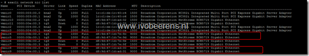
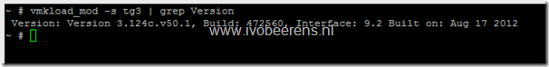
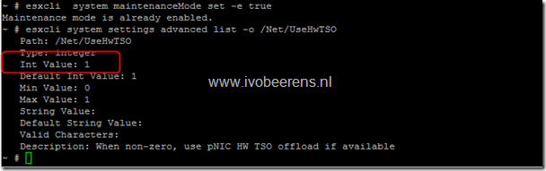
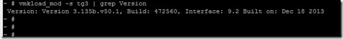

VMware has released a new KB article (2072515) on possible data corruption with Broadcom adapters that use the tg3 driver. This problem can occur when:

- The system is configured with greater than 4 GB RAM
- TCP Segmentation Offload (TSO) is enabled on the adapter
- The system is running ESXi/ESX 3.5, 4.x, 5.0, 5.1 and 5.5
- The tg3 driver version is less than v3.135b

The advice is to update to the latest tg3 driver that fix the problem. If you are using Broadcom adapters you need to check the following components on your VMware ESXi hosts to determine if the data corruption problem can occur:

- What is the driver version of the Broadcom tg3 driver. All the tg3 drivers earlier than version 3.135b.v50.1 must be updated
- Is TSO enabled

### Check the Broadcom tg3 driver version and if TSO is enabled

- Open a SSH session to the ESXi host.
- Get an overview on all the NICs installed in the ESXi server:  `esxcli network nic list`

- Display the Broadcom tg3 driver version, command: `vmkload_mod -s tg3 | grep Version`

- Check if TSO is enabled, command: `esxcli system settings advanced list -o /Net/UseHwTSO`

 

Is the Int value equal to **1** than TSO is enabled.

So if the tg3 driver version is earlier than version 3.135b.v50.1 and TSO is enabled you need to update the driver!

### Update the Broadcom tg3 driver (steps for updating an ESXi 5.1 host):

- Download the new tg3 driver:

- ESXi 5.5: [version 3.135b.v55.1](https://my.VMware.com/web/VMware/details?downloadGroup=DT-ESXI55-BROADCOM-TG3-3135BV551&productId=353) (released on 12/27/2013) or later
- ESXi 5.0 / 5.1: [version 3.135b.v50.1](https://my.VMware.com/web/VMware/details?downloadGroup=DT-ESXI5X-BROADCOM-TG3-3135BV501&productId=229) (released on 12/27/2013) or later
- For ESXi/ESX 3.5/4.x, there is currently no fix. The only way is to disable TSO. For more information see the VMware KB article on the end of the blog post.

- Place the host in maintenance mode, command: `esxcli system maintenanceMode set -e true`
- Upload the driver to a datastore
- Install the updated driver, command: `esxcli software vib install -d /vmfs/volumes/datastore location/tg3-3.135b.v50.1-offline\_bundle-1502404.zip`
- Reboot  the host, command: reboot
- Check the tg3 driver version again, command: `vmkload_mod -s tg3 | grep Version`

- The tg3 driver must have the new version number
- Exit maintenance mode. Command: `esxcli system maintenanceMode set -e false`

Execute the steps on all the ESXi host that have tg3 drivers installed. The VMware KB article can be found here. [Link](http://kb.VMware.com/selfservice/microsites/search.do?language=en_US&cmd=displayKC&externalId=2072515#.Uv5ynXq1Omc.twitter)