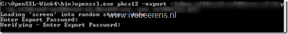
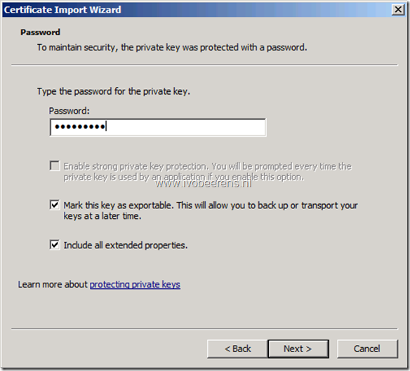
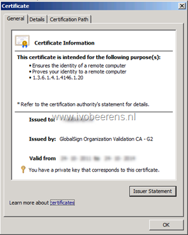
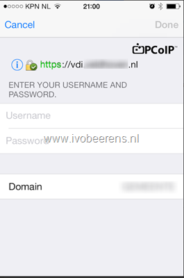

On a View Security Server I needed to change the default self signed certificate to a signed wildcard certificate. The customer had a wildcard certificate that didn't include the private key. A certificate that include the private key is a requirement for a VMware View Security server.

If you have the certificate (*.cer or *.crt) and private key (*.key), convert it to a PCKS#12 (PFX) format before you import the certificate. To create a certificate that include the private key I used the following steps:

- Download and install OpenSSL and Visual C++ 2008 Redistributables. [Link](http://slproweb.com/products/Win32OpenSSL.html)
- The install folder of OpenSSL is: `C:\OpenSSL-Win64\`
- Place the certificate (*.cer or *.crt) and private key (*.key) file in the `C:\OpenSSL-Win64\bin directory` folder
- Open a command prompt and set the environment variable: `Set OPENSSL_CONF=c:\OpenSLL-Win64\bin\openssl.cfg`
- Create another environment variable: `Set RANDFILE = .rnd`
- Generate a PCKS#12 (PFX) keystore file from the private key and certificate file. Syntax example: `OpenSSL.exe pkcs12 –export -out newcertificatename.pfx –inkey privatekey.key –in certificate.crt`

- Enter the password for the certificate

The next step is to Import the certificate on the security server:

- Open the MMC on the Security Server and add the Certifcates snap-in
- In the Windows local computer store import the generated P12 certificate
- Type the password for the private key
- Make sure the certificate is exportable
- Change the friendly name to `vdm` and make sure that the friendly name of the self signed certificate is changed to something else
- Restart the View Connection Security service

The new wildcard certificate has a private key and is trusted in the VMware View client and on the View Administrator page.

<table border="0" width="400" cellspacing="0" cellpadding="2"><tbody><tr><td valign="top" width="200"></td><td valign="top" width="200"></td></tr></tbody></table>