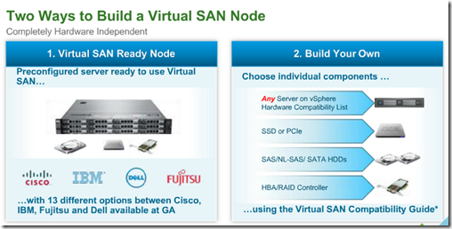

VMware has today announced VSAN. Here are some highlights from the Q&A session:
- VSAN will be GA at March 10 2014
- vSphere 5.5 Update 1 will support VSAN GA
- Beta  VSAN upgrades to the GA release are not supported
- VSAN is not a VSA. Performance is much better than any VSA
- Pricing and packaging will covered on the GA date
- Performance of VSAN scales linear as you add more hardware (extra nodes with storage)
- Initial release of VSAN requires SSD and HDD. So using only SSD disks and no HDDs it not possible
- VSAN use cases are for example: VDI, Tier 2/3 workloads and Disaster Recovery cases
- VMware Horizon View will be supported in the GA release
- The minimum for VSAN is 3 ESXi nodes and the maximum is 32 nodes
- The minimum is 1 HDD and 1 SSD. The maximum is 35 HDDs and one SSD per 7 HDDs
- Minimum NIC speed is 1 Gbps, recommended NIC speed is 10 Gbps
- Replication is synchronously
- Every seven HDDs needs a SSD. SSD and HDD Ratio is 1:10 (GB)
- No de-dupe is supported in the GA version
- Hardware vendors such as Dell, HP and Cisco will support VSAN as VSAN Ready nodes. Watch the VMware Compatibility Guide at GA. [Link](http://www.VMware.com/resources/compatibility/search.php?deviceCategory=vsan)
- You can build your own VSAN with certified hardware
- There will be 13 pre configurations solutions available on the GA date

- JBOD is not supported in the GA release
- What is the difference with MS storage spaces: MS Storage spaces is presenting a file server from dedicated servers and JBODs. VSAN is object storage and doesn't require dedicated servers, it uses the same servers you have for your compute, and other benefits like flash cache acceleration, storage policy management and automation and more.