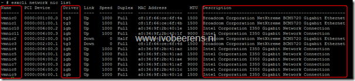
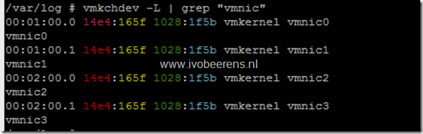
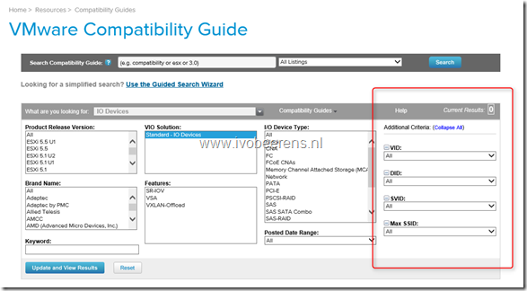
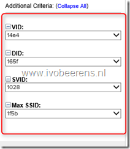
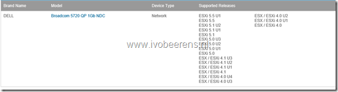
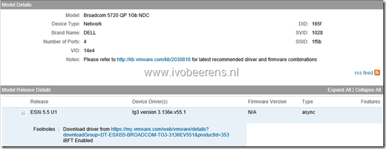
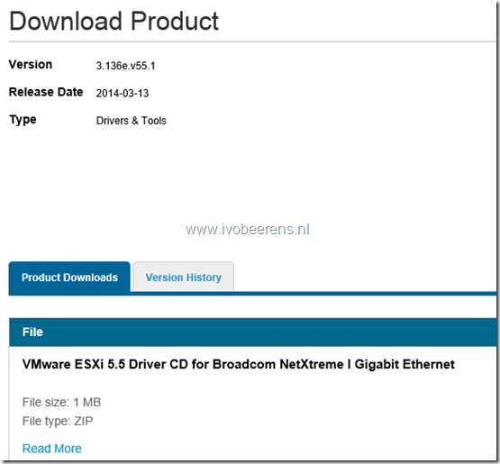

Lately, I troubleshooted some NIC driver problems in VMware ESXi. During the troubleshooting, I needed to Identify the NIC driver, the software version used, and the latest driver version supported by VMware. Here are the steps outlined.

#### Identify the NIC driver and software version:

- Make an SSH connection to the ESXi host
- Identify all the NICs by using the following command: `esxcli network nic list`

[](images/image11.png)

- In this example you can see that Intel (igb) and Broadcom (tg3) NICs are used.
- To identify the driver version of the Broadcom NIC (vmnic0) use the following command: `esxcli network nic get -n "vmnic0`

> driver: **tg3** version: **3.135b.v50.1** firmware-version: **FFV7.6.14 bc 5720-v1.31** bus-info: 0000:01:00.0

#### Identify the latest NIC driver supported by VMware:

- We need to find the hardware IDs of the NIC by using the following command: `vmkchdev -L | grep "vmnic"`

[](images/image31.png)

The hardware ID contains the following parts:

```
VID = Vendor Id (Red part) 
DID = Device Id (Yellow part) 
SVID = Sub-Vendor Id (Green part) 
SSID = Sub-Device Id (Blue part)
```

- Open the VMware Compatibility Guide (HCL) webpage and choose IO Devices, [Link](http://www.VMware.com/resources/compatibility/search.php?deviceCategory=io)

[](images/image10.png)

- On the right you see the "Additional Criteria" column. Enter the VID, DID, SVID, and SSID generated by the `vmkchdev` command

[](images/image14.png)

- Click the "Update and View Results" button
- The NIC is displayed, click on the Model

[](images/image17.png)

- Expand the version of ESXi (release) used. Click on the the Download link (if exist).

[](images/image21.png)

- Download the driver and use VMware Update Manager (VUM) or use `esxcli software vib update` command to install the driver

[](images/image26.png)