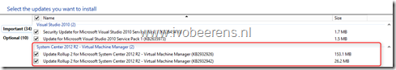
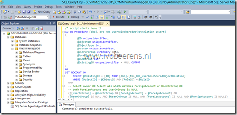
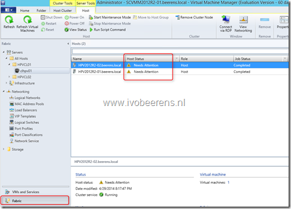
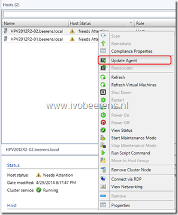
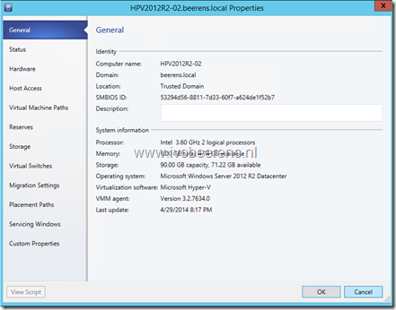
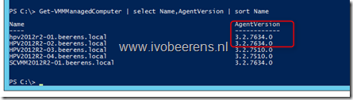

Last week Update Rollup 2 (UR2) for System Center 2012 R2 Virtual Machine Manager is released. UR2 contains important fixes for SCVMM2012 R2. Here are some deployment tips for UR2:

- Wait a least couple of weeks before deploying Update Rollups in your production environment. It happens that new Update Rollups contains huge bugs and are pulled back!
- Make sure you have a backup of the SCVMM database before installing UR2
- Install the UR2 by download the VMM management server and VMM admin console packages [link](http://support.microsoft.com/kb/2932926) (or use Windows Update /WSUS to install both packages). Older packages such as UR1 does not need to be removed. In a SCVMM HA environment install UR2 first on the passive node, perform a failover and install UR2 on the other node.

[](images/image9.png)

- After installing UR2 update execute the SQL script listed in the KB2932926 article on the SCVMM database

[](images/image12.png)

- In the VMM console check the version by selecting help. The UR2 must be `3.2.7634.0`.
- This step is often forgotten. In the VMM admin console perform a cluster refresh (**Fabric-Cluster-Refesh**). After the refresh job completes the host status is changed in "Needs Attention". This means that the VMM agent must be updated on all the hosts.

[](images/image13.png)

- Update the VMM agent by right click on the host en choose "Update Agent". No reboot of the host is required. Using PowerShell the `Update-VMMManagedComputer` cmdlet can be used to update the agent

[](images/image15.png)

- After the VMM agent is updated on the host check the version of the agent on the general tab on the host. The UR2 agent version must be `3.2.7634.0`.

[](images/image16.png)

- With PowerShell you can list all the agent versions by using:

```Get-VMMMangedComputer | Select Name, AgentVersion```

[](images/image18.png)

**System Center Virtual Machine Manager (SCVMM) 2012 R2 builds and versions**

<table border="0" width="480" cellspacing="0" cellpadding="2"><tbody><tr><td valign="top" width="85"><strong>Build</strong></td><td valign="top" width="393"><strong>Version</strong></td></tr><tr><td valign="top" width="85">3.2.7510.0</td><td valign="top" width="393">System Center 2012 R2 Virtual Machine Manager RTM</td></tr><tr><td valign="top" width="85">3.2.7620.0</td><td valign="top" width="393">Update Rollup 1 (UR1)</td></tr><tr><td valign="top" width="85">3.2.7634.0</td><td valign="top" width="393">Update Rollup 2 (UR2)</td></tr><tr><td valign="top" width="85">3.2.7672.0</td><td valign="top" width="393">Update Rollup 3 (UR3)</td></tr><tr><td valign="top" width="85">3.2.7768.0</td><td valign="top" width="393">Update Rollup 4 (UR4)</td></tr><tr><td valign="top" width="85">3.2.7895.0</td><td valign="top" width="393">Update Rollup 5 (UR5)</td></tr><tr><td valign="top" width="85">3.2.8002.0</td><td valign="top" width="393">Update Rollup 6 (UR6)</td></tr><tr><td valign="top" width="85">3.2.8071.0</td><td valign="top" width="393">Update Rollup 7 (UR7)</td></tr><tr><td valign="top" width="85">3.2.8117.0</td><td valign="top" width="393">Update Rollup 8 (UR8)</td></tr><tr><td valign="top" width="85">3.2.8145.0</td><td valign="top" width="393">Update Rollup 9 (UR9)</td></tr><tr><td valign="top" width="85">3.2.8169.0</td><td valign="top" width="393">Update Rollup 10 (UR10)</td></tr><tr><td valign="top" width="85">3.2.8224.0</td><td valign="top" width="393">Update Rollup 11&nbsp;(UR11)</td></tr><tr><td valign="top" width="85">3.2.8228.0</td><td valign="top" width="393">Update Rollup 11 (Hotfix 1)</td></tr><tr><td valign="top" width="85">3.2.8292.0</td><td valign="top" width="393">Update Rollup 12&nbsp;(UR12)</td></tr></tbody></table>