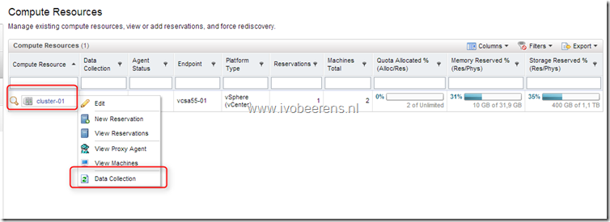
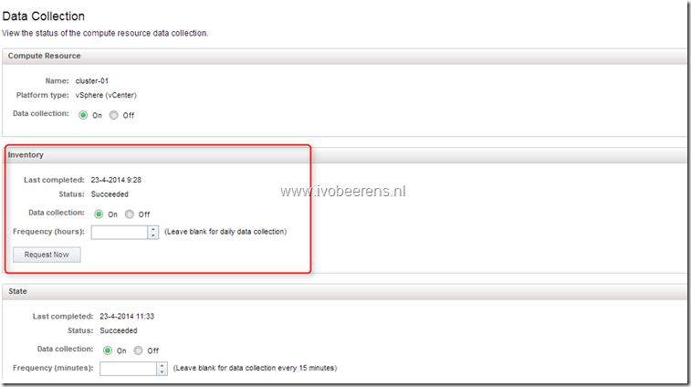

When creating a new template in vCenter and want to use the new created template in a blueprint, the blueprint will not list the template because the vCenter inventory isn't updated in vCAC. By default vCAC will update the vCenter inventory once a day. To manually update the vCenter inventory in vCAC 6.x use the following steps:

- Login the vCloud Automation Center console
- Select the Infrastructure tab
- Select Compute Resources
- Select the Compute Resource you want to update. In this example it's "cluster-01"
- Select "Data Collection"

- Click on the "Request Now" button in the Inventory field update the vCenter inventory.
- Wait till the vCAC page refeshes and check the last completed and status field to be sure that the refresh succeeded.

- Creating a new blueprint will list the new created template in vCenter