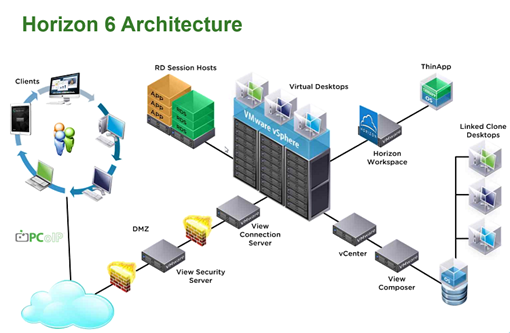
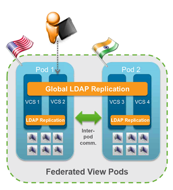
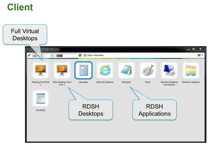
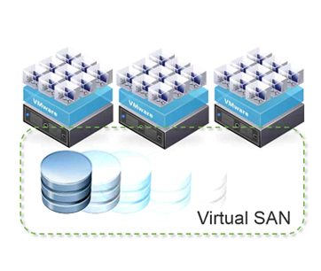
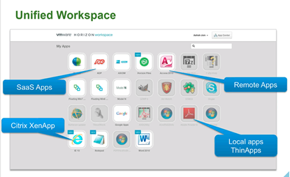
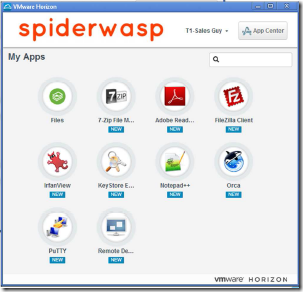
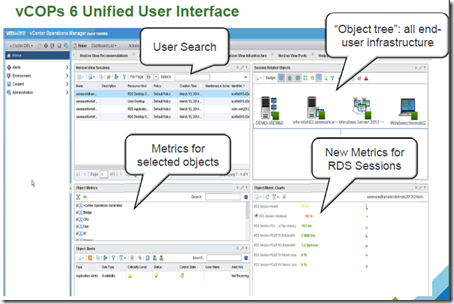

VMware Horizon 6 has been today announced. VMware Horizon 6 has five major enhancements:
- Cloud Pod Architecture.
- Remote Desktop Session Host (RDS) Hosted Apps
- Virtual SAN
- Application Catalog
- vCops for View 6

Here is an overview picture of the Horizon 6 architecture:

#### Cloud Pod Architecture

In version 5 Horizon View supports 10.000 desktops in a Pod.  If you need to to have more or than 10.000 desktops or needed to span a datacenter another Pod was needed.  With the Cloud Pod Architecture the following improvements has been made :

- Enable Horizon deployments across multiple datacenters
- New data layer replication across all Horizon Connection Servers (such as pool configurations and user entitlements).
- Support single namespace for end users with a global URL
- Global entitlement layer to assign and manage desktops and users

Benefits:

- Scale Horizon View deployments to multiple datacenter above 10.000 desktops
- Support Active/Active and DR use case of Horizon deployments
- Support geo-reaming users

Maximums of the Cloud Pod Architecture

<table cellspacing="0" cellpadding="2" width="400" border="0"><tbody><tr><td valign="top" width="200"><strong>Description</strong></td><td valign="top" width="200"><strong>Number</strong></td></tr><tr><td valign="top" width="200">Number of sites (datacenters)</td><td valign="top" width="200">2</td></tr><tr><td valign="top" width="200">Number of Pods</td><td valign="top" width="200">4</td></tr><tr><td valign="top" width="200">Number of users/desktops (sessions)</td><td valign="top" width="200">20.000</td></tr></tbody></table>

The Horizon 6 View infrastructure servers supports Windows Server 2012 R2 as Operating System.

#### RDS Hosted Apps

Prior Horizon 6 VMware only offers a VDI desktops. With RDS Hosted Apps in Horizon 6, VMware offers access to applications and full desktops running on Microsoft Remote Desktop Services Hosts with the PCoIP and Blast protocol. The RDS apps are available to the Horizon View broker.

Benefits

- Windows 2008 and 2012 Microsoft Remote Desktop Services Hosts are supported
- Seamless local look, feel and interaction for users
- Works with Windows and Non-Windows devices such as Windows XP, Windows 7 and Windows 8 desktops, laptops and thin clients, iOS and Android tablets and Mac OSX. A client for Linux will be available soon

In the View clients the full desktops and RDSH applications looks as follows:

#### Virtual SAN for Horizon View Desktops

In Horizon View 5.3.1 support for VSAN was added. It was available as separate product. Now in Horizon 6 VSAN is added for free in the Horizon 6 Advanced and Enterprise Edition!

 

#### Application Catalog

The Application Catalog offers a unified workspace for applications. One portal to for all applications (Local ThinApps, Citrix XenApp, SAAS and Remote Apps) from different devices.

The Application Catalog key themes are:

- XenApp integration in the Application catalog
- ThinApp package delivery on any Windows desktop
- Office 365 and non-SAML web apps
- Improved resource management & categorization
- Seamless integration with Horizon View

The application catalog  has multi-forest Active Directory support and can be easily customized by changing logos, login prompt, application launchers, backgrounds etc.

 

#### vCops for View 6

vCenter Operations Manager for View 6 has the following new improvements:

- Horizon 6 support
- 25K concurrent users per instance
- Single integrated console for all vCOPs support environments (desktop, server etc)
- Application & In Guest Metrics. Drill down to the process level for key resource consumption per user and application

 

#### Licenses

Horizon 6 has three new editions available:

- **Horizon View Standard Edition**: Delivers simple, high-performance VDI-based virtual desktops with a great user experience

- **Horizon Advanced Edition**: Offers the lowest cost solution for virtual desktop and application management, optimized storage with VMware Virtual SAN, image management and a unified workspace that supports hosted desktops and applications.

- **Horizon Enterprise Edition**: Delivers a cloud-ready solution for virtual desktops and applications with advanced cloud automation and management capabilities for hybrid cloud flexibility.

More information can be found on the pricing page, [link](http://www.VMware.com/nl/products/horizon-view/pricing.html) .

The Horizon 6 enhancements are a big step for the End-User Computing (EUC) market!
