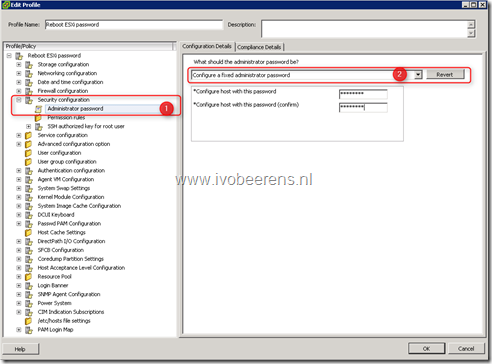
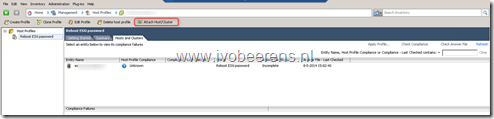
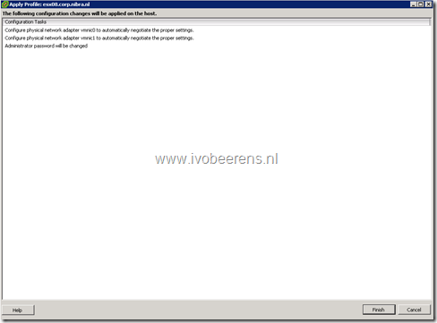
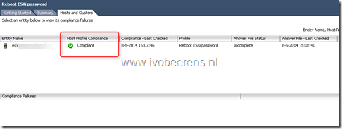
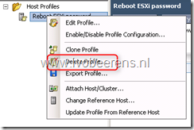

Some time ago I needed to make a SSH connection to a new installed ESXi server. The default root password the customer was using was not working. The admin who installed the ESXi server didn't known the password anymore. So i needed to reset the password. The VMware Knowledge Base states the following on resetting the root password on ESXi:

> Reinstalling the ESXi host is the only supported way to reset a password on ESXi.  Any other method may lead to a host failure or an unsupported configuration due to the complex nature of the ESXi architecture. ESXi does not have a service console and as such traditional Linux methods of resetting a password, such as single-user mode do not apply. [Link](https://kb.vmware.com/s/article/1317898)

I didn't have the time to reinstall the ESXi server.I remember that Host Profiles has an option to reset the root password. Host Profiles is a feature of the Enterprise plus license. The customer license was Enterprise and not Enterprise Plus. So I requested a 60 day trail license of VMware vSphere. The trail include a Enterprise Plus license.

Here is an overview of the steps to reset the root password:

- Enter the trail license in the vSphere Client  and register the host with the trail license
- Put the host in Maintenance mode
- Open the vSphere Client
- In Host Profiles, Create a Profile from existing host and select the host, enter the Name
- Nagivate to the security configuration, Administrator Password and select "Configure a fixed administrator password"
- Enter the new root password twice

- Attach the host profile to the host

- Right-click the host and select Apply Profile

- Wait till the Host Profile Compliance status is Compliant. The root password is now changed!

- Test if it is possible to SSH to the ESXi host
- Delete the Host Profile

- Change the license from Enterprise Plus to the original license
- Remove the Enterprise Plus license
- Exit maintenance mode