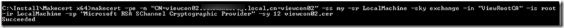
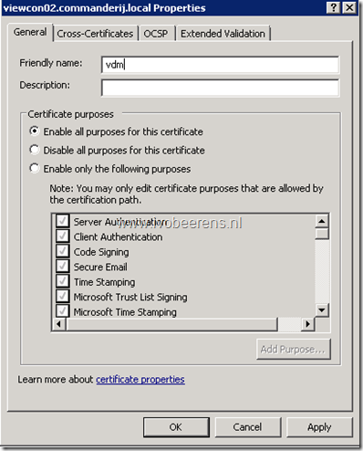

With the command line Windows utility **makecert.exe** it is possible to create quickly a self-signed (private) certificate that can be used with VMware Horizon View. Makecert is part of the Windows Software Deployment Kit (SDK)for Windows 7 and 8. Below are the steps outlined to create a self-signed certificate using makecert.

- The SDK can be downloaded here, [link](http://www.microsoft.com/en-us/download/details.aspx?id=8279). Install the SDK and choose as feature to install "Windows Software Deployment".
- After the installation copy the makecert.* utility to the VMware View Connection server
- Open a elevated command prompt
- Create the self-signed root certificate, command: `makecert -pe -n "CN=ViewRootCA" -ss root -sr LocalMachine -sky signature -r "ViewRootCA.cer`

- Open certlm.msc and go to "Trusted Root Certification Authorities" and verify if the root certificate generated with makecert.exe exist. The root certificate can copied to all the servers and View Clients. If the clients are domain joined a Group Policy can be used to distribute the root certificate. More information can be found here, [link](http://technet.microsoft.com/en-us/library/cc772491.aspx).

- Create a new self-signed certificate, command: `makecert -pe -n "CN=viewcon02.beerens.local,cn=viewcon02" -ss my -sr LocalMachine -sky exchange -in "ViewRootCA" -is root -ir LocalMachine -sp "Microsoft RSA SChannel Cryptographic Provider" -sy 12 viewcon02.cer`

- The certificate is added to the personal store of the local computer

- Change the Friendly name of the newly created self-signed certificate to: `vdm`
- Remove the already existing self-signed certificate

- Restart the VMware View Connection Server service
- In the System Health dashboard the Connection Server system health gets green

