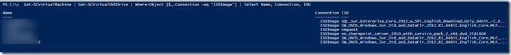

In the jobs window in the System Center Virtual Machine Manager (SCVMM) console , the following warning appeared:

```
Warning (10803)
Unable to refresh \\server\share\ISO\Windows2012 R2\SW_DVD5_Windows_Svr_Std_and_DataCtr_2012_R2_64Bit_English_Core_MLF_X19-05182.ISO because the file is in use by another process.

Recommended Action
Wait for the next automatic library refresh, or manually refresh the library share after the process completes.
```

The warning means that the ISO file is in use by one or more VMs. To find the VMs that are using the ISO file I created the following PowerShell script:

```powershell
Import-module VirtualMachineManager
Get-SCVMMServer -ComputerName VMMSERVER
Get-SCVirtualMachine | Get-SCVirtualDVDDrive | Where-Object {$_.Connection -eq "ISOImage"} | Select Name, Connection, ISO
```
This script displays all the VMs that have an ISO file attached. The script is tested against a SCVMM 2012 R2 server.

[](images/image1.png)

After changing the VMs Virtual DVD drive to "No media" the hourly (default) refresh of the library went without a warning.

[](images/image2.png)